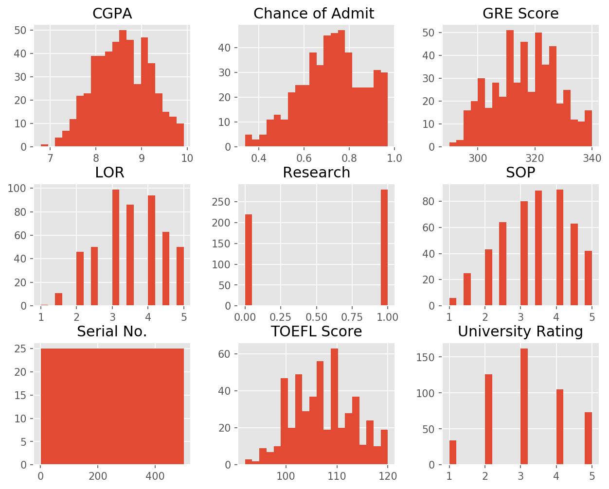
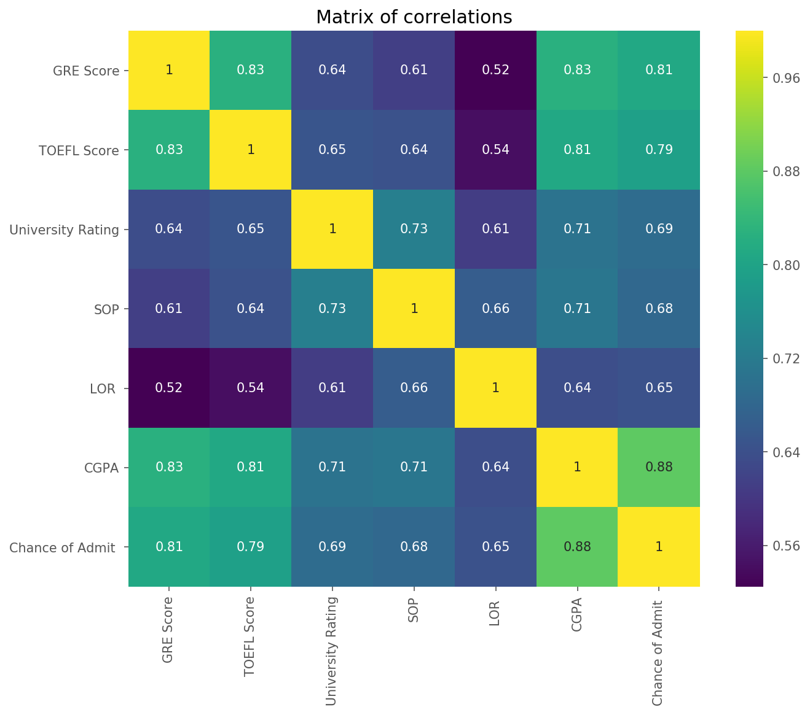
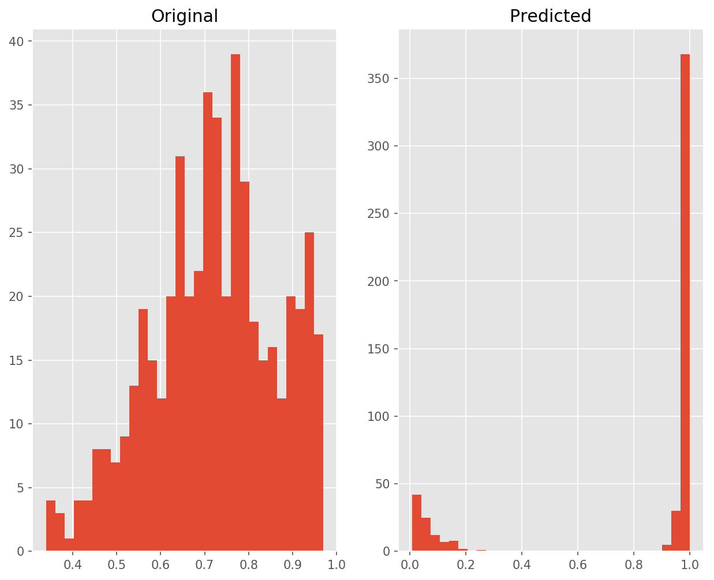
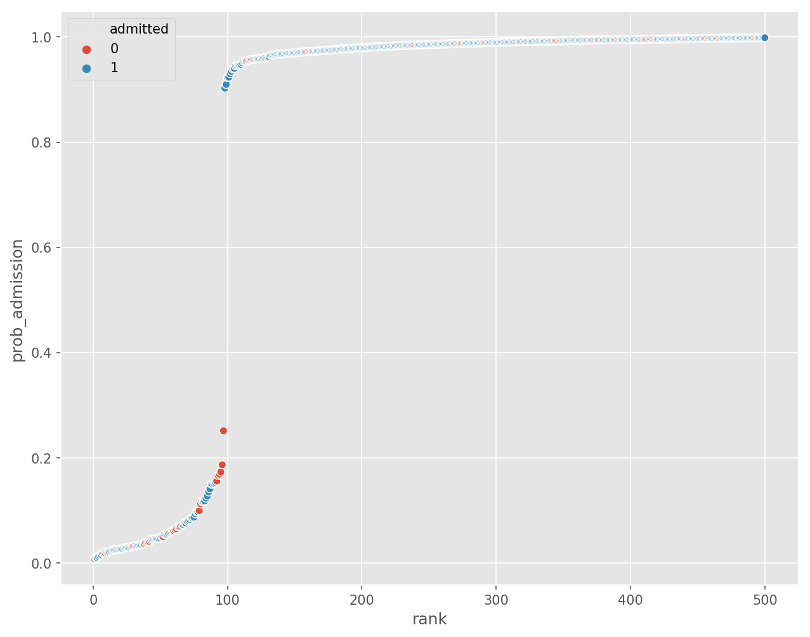
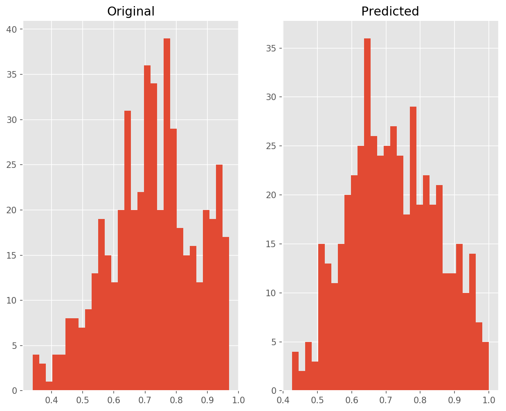
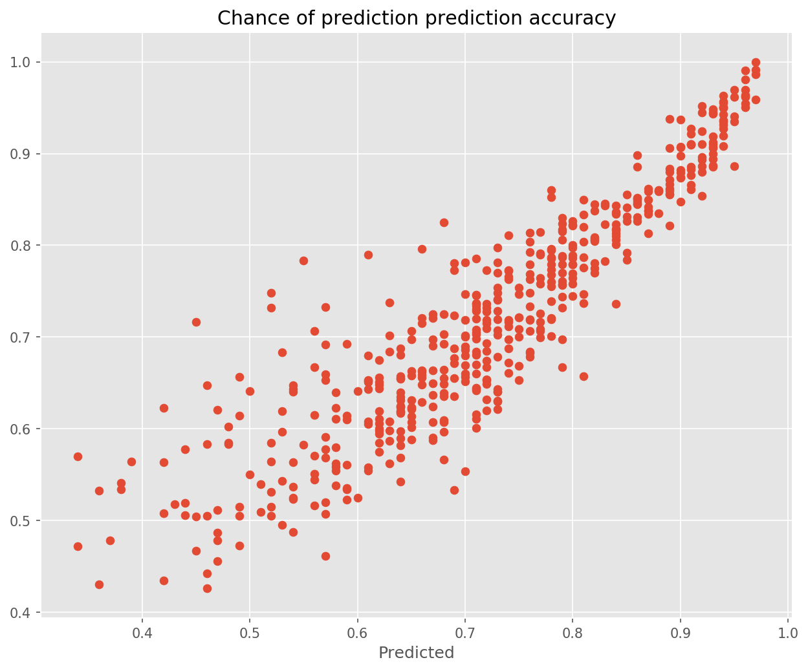

---
authors:
- admin
categories: [Python, ML]
date: "2019-06-06"
draft: false
featured: true
image:
  caption: ""
  focal_point: ""
projects: []
subtitle: 
summary: Use the Machine Learning capabilities of Python to predict the chance of admission in Universities
tags: [Python, sklearn, ML]
title: Chance of admission : Regression & Classification
---

```python
%matplotlib inline
import numpy as np # linear algebra
import pandas as pd # data processing, CSV file I/O (e.g. pd.read_csv)
import matplotlib.pyplot as plt
import seaborn as sns
```

# Read in the dataset


```python
dataset = pd.read_csv("Admission_Predict_Ver1.1.csv")
```

The dataset has been read successfully. Now it is good that we explore it to understand the features


```python
print(f"The dataset contains {dataset.shape[0]} observations and {dataset.shape[1]} columns")
```

    The dataset contains 500 observations and 9 columns
    

Let's have a glimpse on a sample of the dataset.


```python
dataset.sample(5)
```


<div>
<style scoped>
    .dataframe tbody tr th:only-of-type {
        vertical-align: middle;
    }

    .dataframe tbody tr th {
        vertical-align: top;
    }

    .dataframe thead th {
        text-align: right;
    }
</style>
<table border="1" class="dataframe">
  <thead>
    <tr style="text-align: right;">
      <th></th>
      <th>Serial No.</th>
      <th>GRE Score</th>
      <th>TOEFL Score</th>
      <th>University Rating</th>
      <th>SOP</th>
      <th>LOR</th>
      <th>CGPA</th>
      <th>Research</th>
      <th>Chance of Admit</th>
    </tr>
  </thead>
  <tbody>
    <tr>
      <th>404</th>
      <td>405</td>
      <td>311</td>
      <td>101</td>
      <td>3</td>
      <td>2.0</td>
      <td>2.5</td>
      <td>7.64</td>
      <td>1</td>
      <td>0.62</td>
    </tr>
    <tr>
      <th>435</th>
      <td>436</td>
      <td>309</td>
      <td>105</td>
      <td>2</td>
      <td>2.5</td>
      <td>4.0</td>
      <td>7.68</td>
      <td>0</td>
      <td>0.55</td>
    </tr>
    <tr>
      <th>264</th>
      <td>265</td>
      <td>325</td>
      <td>110</td>
      <td>2</td>
      <td>3.0</td>
      <td>2.5</td>
      <td>8.76</td>
      <td>1</td>
      <td>0.75</td>
    </tr>
    <tr>
      <th>60</th>
      <td>61</td>
      <td>309</td>
      <td>100</td>
      <td>2</td>
      <td>3.0</td>
      <td>3.0</td>
      <td>8.10</td>
      <td>0</td>
      <td>0.48</td>
    </tr>
    <tr>
      <th>424</th>
      <td>425</td>
      <td>325</td>
      <td>114</td>
      <td>5</td>
      <td>4.0</td>
      <td>5.0</td>
      <td>9.46</td>
      <td>1</td>
      <td>0.91</td>
    </tr>
  </tbody>
</table>
</div>


**Taken from the data description : **
 > The dataset contains several parameters which are considered important during the application for Masters Programs. The parameters included are : 
 > 1. GRE Scores ( out of 340 ) 
 > 2. TOEFL Scores ( out of 120 ) 
 > 3. University Rating ( out of 5 ) 
 > 4. Statement of Purpose and Letter of Recommendation Strength ( out of 5 ) 
 > 5. Undergraduate GPA ( out of 10 ) 
 > 6. Research Experience ( either 0 or 1 ) 
 > 7. Chance of Admit ( ranging from 0 to 1 )


```python
dataset.drop(columns= "Serial No.", axis = 1).describe()
```


<div>
<style scoped>
    .dataframe tbody tr th:only-of-type {
        vertical-align: middle;
    }

    .dataframe tbody tr th {
        vertical-align: top;
    }

    .dataframe thead th {
        text-align: right;
    }
</style>
<table border="1" class="dataframe">
  <thead>
    <tr style="text-align: right;">
      <th></th>
      <th>GRE Score</th>
      <th>TOEFL Score</th>
      <th>University Rating</th>
      <th>SOP</th>
      <th>LOR</th>
      <th>CGPA</th>
      <th>Research</th>
      <th>Chance of Admit</th>
    </tr>
  </thead>
  <tbody>
    <tr>
      <th>count</th>
      <td>500.000000</td>
      <td>500.000000</td>
      <td>500.000000</td>
      <td>500.000000</td>
      <td>500.00000</td>
      <td>500.000000</td>
      <td>500.000000</td>
      <td>500.00000</td>
    </tr>
    <tr>
      <th>mean</th>
      <td>316.472000</td>
      <td>107.192000</td>
      <td>3.114000</td>
      <td>3.374000</td>
      <td>3.48400</td>
      <td>8.576440</td>
      <td>0.560000</td>
      <td>0.72174</td>
    </tr>
    <tr>
      <th>std</th>
      <td>11.295148</td>
      <td>6.081868</td>
      <td>1.143512</td>
      <td>0.991004</td>
      <td>0.92545</td>
      <td>0.604813</td>
      <td>0.496884</td>
      <td>0.14114</td>
    </tr>
    <tr>
      <th>min</th>
      <td>290.000000</td>
      <td>92.000000</td>
      <td>1.000000</td>
      <td>1.000000</td>
      <td>1.00000</td>
      <td>6.800000</td>
      <td>0.000000</td>
      <td>0.34000</td>
    </tr>
    <tr>
      <th>25%</th>
      <td>308.000000</td>
      <td>103.000000</td>
      <td>2.000000</td>
      <td>2.500000</td>
      <td>3.00000</td>
      <td>8.127500</td>
      <td>0.000000</td>
      <td>0.63000</td>
    </tr>
    <tr>
      <th>50%</th>
      <td>317.000000</td>
      <td>107.000000</td>
      <td>3.000000</td>
      <td>3.500000</td>
      <td>3.50000</td>
      <td>8.560000</td>
      <td>1.000000</td>
      <td>0.72000</td>
    </tr>
    <tr>
      <th>75%</th>
      <td>325.000000</td>
      <td>112.000000</td>
      <td>4.000000</td>
      <td>4.000000</td>
      <td>4.00000</td>
      <td>9.040000</td>
      <td>1.000000</td>
      <td>0.82000</td>
    </tr>
    <tr>
      <th>max</th>
      <td>340.000000</td>
      <td>120.000000</td>
      <td>5.000000</td>
      <td>5.000000</td>
      <td>5.00000</td>
      <td>9.920000</td>
      <td>1.000000</td>
      <td>0.97000</td>
    </tr>
  </tbody>
</table>
</div>


# Visualizations

Let's visualize the columns to have insights on the dataset


```python
# Plot settings
plt.rcParams["figure.figsize"] = [10,8]
plt.rcParams["figure.dpi"] = 150
plt.style.use("ggplot")
```

# Histograms


```python
dataset.hist(bins = 20);
```





## Insights :
- Most of the continuous numerical columns seem to be relatively normally distributed (gaussian distribution). 
- More universities have a ranking of 3/5
- There are more students with a Research experience than without.

# Correlation among continuous variables


```python
sns.heatmap(dataset.drop(columns= ["Research", "Serial No."]).corr(), 
            cmap= "viridis", annot = True);
plt.title("Matrix of correlations");
```





All the variables are positively correlated among them. The weakest correlation is around 0.52 (LOR and GRE Score). 

Let's continue exploring the data by taking a look at the pairplot


```python
sns.pairplot(dataset.drop(columns= ["Research", "Serial No."]));
```


# Modelling

My goal here is to predict the chance of admit using a logistic regression.


```python
from statsmodels.api import Logit
```


```python
train = dataset.drop(columns= ["Serial No."])
```

The `Research` column need to be transformed into a dummy column


```python
train = pd.get_dummies(train, columns= ["Research"], drop_first= True)
```


```python
from sklearn.linear_model import LogisticRegression
```


```python
train.head()
```


<div>
<style scoped>
    .dataframe tbody tr th:only-of-type {
        vertical-align: middle;
    }

    .dataframe tbody tr th {
        vertical-align: top;
    }

    .dataframe thead th {
        text-align: right;
    }
</style>
<table border="1" class="dataframe">
  <thead>
    <tr style="text-align: right;">
      <th></th>
      <th>GRE Score</th>
      <th>TOEFL Score</th>
      <th>University Rating</th>
      <th>SOP</th>
      <th>LOR</th>
      <th>CGPA</th>
      <th>Chance of Admit</th>
      <th>Research_1</th>
    </tr>
  </thead>
  <tbody>
    <tr>
      <th>0</th>
      <td>337</td>
      <td>118</td>
      <td>4</td>
      <td>4.5</td>
      <td>4.5</td>
      <td>9.65</td>
      <td>0.92</td>
      <td>1</td>
    </tr>
    <tr>
      <th>1</th>
      <td>324</td>
      <td>107</td>
      <td>4</td>
      <td>4.0</td>
      <td>4.5</td>
      <td>8.87</td>
      <td>0.76</td>
      <td>1</td>
    </tr>
    <tr>
      <th>2</th>
      <td>316</td>
      <td>104</td>
      <td>3</td>
      <td>3.0</td>
      <td>3.5</td>
      <td>8.00</td>
      <td>0.72</td>
      <td>1</td>
    </tr>
    <tr>
      <th>3</th>
      <td>322</td>
      <td>110</td>
      <td>3</td>
      <td>3.5</td>
      <td>2.5</td>
      <td>8.67</td>
      <td>0.80</td>
      <td>1</td>
    </tr>
    <tr>
      <th>4</th>
      <td>314</td>
      <td>103</td>
      <td>2</td>
      <td>2.0</td>
      <td>3.0</td>
      <td>8.21</td>
      <td>0.65</td>
      <td>0</td>
    </tr>
  </tbody>
</table>
</div>


```python
np.median(dataset["Chance of Admit "])
```


    0.72


Let's create a binary column called `admit` from the `Chance of Admit` column. The threshold is : if `Chance of Admit` > 0.72 then admit = 1


```python
train["admit"] = dataset["Chance of Admit "].apply(lambda x: 1 if x>0.6 else 0)
```


```python
train["admit"].value_counts()
```


    1    403
    0     97
    Name: admit, dtype: int64


```python
logistic = LogisticRegression()
```


```python
X = train.drop(columns= "Chance of Admit ") # remove 
y = train["admit"]
```


```python
res = logistic.fit(X = X, y = y)
```

    E:\Continuum\anaconda3\lib\site-packages\sklearn\linear_model\logistic.py:433: FutureWarning: Default solver will be changed to 'lbfgs' in 0.22. Specify a solver to silence this warning.
      FutureWarning)
    


```python
prob_admission = []
for not_admitted, admitted in res.predict_proba(X):
    prob_admission.append(admitted)
```


```python
plt.subplot(1,2,1)
plt.hist(dataset["Chance of Admit "], bins = 30)
plt.title("Original")
plt.subplot(1,2,2)
plt.hist(prob_admission, bins = 30)
plt.title("Predicted");
```





## Accuracy


```python
logit_results = pd.DataFrame({"prob_admission":prob_admission, 
                             "chance_of_admit": dataset["Chance of Admit "],
                             "admitted":res.predict(X)})
logit_results.head()
```


<div>
<style scoped>
    .dataframe tbody tr th:only-of-type {
        vertical-align: middle;
    }

    .dataframe tbody tr th {
        vertical-align: top;
    }

    .dataframe thead th {
        text-align: right;
    }
</style>
<table border="1" class="dataframe">
  <thead>
    <tr style="text-align: right;">
      <th></th>
      <th>prob_admission</th>
      <th>chance_of_admit</th>
      <th>admitted</th>
    </tr>
  </thead>
  <tbody>
    <tr>
      <th>0</th>
      <td>0.996440</td>
      <td>0.92</td>
      <td>1</td>
    </tr>
    <tr>
      <th>1</th>
      <td>0.993823</td>
      <td>0.76</td>
      <td>1</td>
    </tr>
    <tr>
      <th>2</th>
      <td>0.977416</td>
      <td>0.72</td>
      <td>1</td>
    </tr>
    <tr>
      <th>3</th>
      <td>0.984955</td>
      <td>0.80</td>
      <td>1</td>
    </tr>
    <tr>
      <th>4</th>
      <td>0.946737</td>
      <td>0.65</td>
      <td>1</td>
    </tr>
  </tbody>
</table>
</div>


```python
logit_results["prob_admission"] = np.sort(logit_results["prob_admission"])
logit_results["rank"] = np.arange(1, len(logit_results)+1)
```


```python
sns.scatterplot(x = "rank", y = "prob_admission", 
                data = logit_results, hue = "admitted");
```





# Linear regression


```python
train.head()
```


<div>
<style scoped>
    .dataframe tbody tr th:only-of-type {
        vertical-align: middle;
    }

    .dataframe tbody tr th {
        vertical-align: top;
    }

    .dataframe thead th {
        text-align: right;
    }
</style>
<table border="1" class="dataframe">
  <thead>
    <tr style="text-align: right;">
      <th></th>
      <th>GRE Score</th>
      <th>TOEFL Score</th>
      <th>University Rating</th>
      <th>SOP</th>
      <th>LOR</th>
      <th>CGPA</th>
      <th>Chance of Admit</th>
      <th>Research_1</th>
      <th>admit</th>
    </tr>
  </thead>
  <tbody>
    <tr>
      <th>0</th>
      <td>337</td>
      <td>118</td>
      <td>4</td>
      <td>4.5</td>
      <td>4.5</td>
      <td>9.65</td>
      <td>0.92</td>
      <td>1</td>
      <td>1</td>
    </tr>
    <tr>
      <th>1</th>
      <td>324</td>
      <td>107</td>
      <td>4</td>
      <td>4.0</td>
      <td>4.5</td>
      <td>8.87</td>
      <td>0.76</td>
      <td>1</td>
      <td>1</td>
    </tr>
    <tr>
      <th>2</th>
      <td>316</td>
      <td>104</td>
      <td>3</td>
      <td>3.0</td>
      <td>3.5</td>
      <td>8.00</td>
      <td>0.72</td>
      <td>1</td>
      <td>1</td>
    </tr>
    <tr>
      <th>3</th>
      <td>322</td>
      <td>110</td>
      <td>3</td>
      <td>3.5</td>
      <td>2.5</td>
      <td>8.67</td>
      <td>0.80</td>
      <td>1</td>
      <td>1</td>
    </tr>
    <tr>
      <th>4</th>
      <td>314</td>
      <td>103</td>
      <td>2</td>
      <td>2.0</td>
      <td>3.0</td>
      <td>8.21</td>
      <td>0.65</td>
      <td>0</td>
      <td>1</td>
    </tr>
  </tbody>
</table>
</div>


```python
from sklearn.linear_model import LinearRegression
```


```python
X_linreg = train.drop(columns= ["Chance of Admit ", "admit"])
y_linreg = train["Chance of Admit "]
```


```python
lin_res = LinearRegression()
lin_res = lin_res.fit(X_linreg, y_linreg)
```

# The shape of the two


```python
plt.subplot(1,2,1)
plt.hist(dataset["Chance of Admit "], bins = 30)
plt.title("Original")
plt.subplot(1,2,2)
plt.hist(lin_res.predict(X_linreg), bins = 30)
plt.title("Predicted");
```





```python
plt.scatter(dataset["Chance of Admit "], lin_res.predict(X_linreg))
plt.title("Chance of prediction prediction accuracy");
plt.xlabel("Original")
plt.xlabel("Predicted");
```





```python

```
