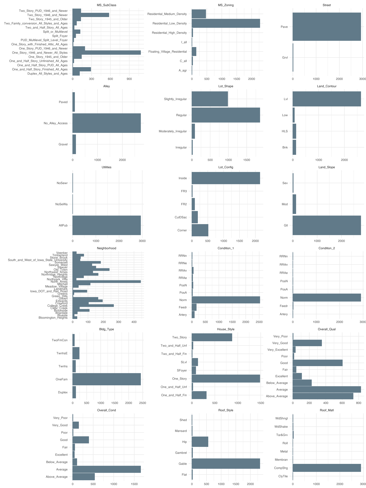
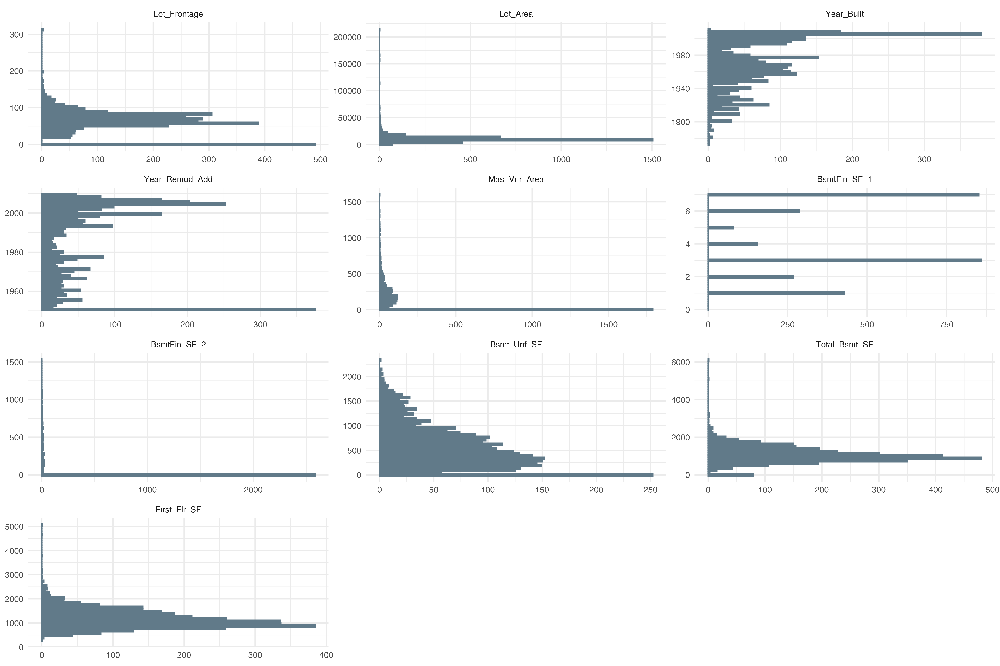

---
authors:
- admin
categories: [R, visualization, Tidyvserse]
date: "2019-07-12"
draft: false
featured: true
image:
  caption: ""
  focal_point: ""
projects: []
subtitle: 
summary: Plot all the columns of your dataset
tags: [R, dplyr, ggplot2, tidyverse]
title: Visualize your dataset columns
---
For data analysis or Machine Learning, understanding your dataset is crucial if you want to get insights or tune your models. One of the best way to understand your dataset is to see it visually.
In this short post I'd like to share with you a way I found not so long ago to help you visualize all the columns of your dataset with ggplot2 without the need to make multiple individual plot.  
With the help of useful packages in the R ecosystem working with all sort of data is extremely easy. 
This tutorial will leverage the ggplot2 package for amazing plot but helper packages such as reshape2, dplyr and caret will also give us more control on what we want to plot.  
To illustrate this I will use the Ames housing dataset.

# Importing packages and dataset


```R
library(dplyr)
library(ggplot2)
ames <- AmesHousing::make_ames()
```


```R
dim(ames)
```


<ol class=list-inline>
	<li>2930</li>
	<li>81</li>
</ol>


The reason why I choose the Ames dataset is because it contains multiple columns of different types. 

# Plot all the categorical columns

As I just said, this dataset contains various columns; here I want to have a look at all the categorical column to understand their distributions, in other word I would like to make a barplot of all the categorical columns that will stand on a single graphic.  
To do so we are using the power of the `facet_wrap()` function of the ggplot2 package. 


```R
select_if(ames, is.numeric) %>% ncol
```


35


We have a total of 35 categorical columns. We can plot all these columns on the same plot to understand their distribution. However 35 different plots on a single plot may not be a readable as we see below. 


```R
options(repr.plot.res = 300, repr.plot.height = 30, repr.plot.width = 15)
theme_set(theme_minimal())

# Select only categorical columns
          
ames %>%
select_if(is.factor) %>%
mutate(id = "factor") %>%
reshape2::melt(id.var = "id") %>%
ggplot(aes(x = value)) + geom_bar() +
coord_flip() + labs(x = NULL, y = NULL) +
facet_wrap(~variable, scale = "free", ncol = 3)
```

    Warning message:
    "attributes are not identical across measure variables; they will be dropped"


## What we just did ?
Let's break down the code we used to produce this plot :
First we use `dplyr::select_if()` to retain only categorical columns, in our case all categorical columns are factors, but it can be character, just provide is.character as argument in `select_if()`. 
After that we use `dplyr::mutate()` to create an arbitrary column called id that will act as the id variable for the next function.  
We then use the `reshape2::melt()` function to gather all the columns and their values into two columns called value and variables. 
We then pipe this result in ggplot2, the aesthetic takes `value` as x for the `geom_point()` function. We flip the coordinates, set the xlab and ylab to NULL and facet the plot according to the variables column produced by the `reshape2::melt()` function.   

Now just for fun let's break this plot into two plots, the first will contain 18 columns and the second 17 so it's more readable.


```R
options(repr.plot.height = 20)
ames %>%
select_if(is.factor) %>%
select(1:18) %>%
mutate(id = "factor") %>%
reshape2::melt(id.var = "id") %>%
ggplot(aes(x = value)) + geom_bar() +
coord_flip() + labs(x = NULL, y = NULL) +
facet_wrap(~variable, scale = "free", ncol = 3)
```

    Warning message:
    "attributes are not identical across measure variables; they will be dropped"





```R
ames %>%
select_if(is.factor) %>%
select(18:35) %>%
mutate(id = "factor") %>%
reshape2::melt(id.var = "id") %>%
ggplot(aes(x = value)) + geom_bar() +
coord_flip() + labs(x = NULL, y = NULL) +
facet_wrap(~variable, scale = "free", ncol = 3)
```

    Warning message:
    "attributes are not identical across measure variables; they will be dropped"


# Put it all in a function
As Hadley Wickam would say, if you're going to reuse a block a code, it's better to put in a function. So far we have used this code for categorical column, we now want to have a function to produce the same plot and change behavior with arguments we provide.


```R
plot_cols <- function(dataset, col_type = "is.numeric", 
                      subset = NULL, facet_scale = "free"){
    
    if(!col_type %in% c("is.numeric", "is.factor", "is.character")){
        stop(message("allowed column types are : is.numeric, is.factor, is.character"))
    }
    
    # Categorical columns 
    
    if (is.null(subset) & col_type %in% c("is.factor", "is.character")) {
        if (ncol(select_if(dataset, col_type))<1){
            
            stop(message("There's no column"))
            
        } else if (!is.null(subset)) {
            select_if(dataset, col_type) %>%
            mutate(id = "id_var") %>%
            reshape2::melt(id.var = "id") %>%
            ggplot(aes(x = value)) + geom_bar() +
            coord_flip() + labs(x = NULL, y = NULL) +
            facet_wrap(~variable, scale = "free", ncol = 3)
            
        } else {
            select_if(dataset, col_type) %>%
            select(subset) %>%
            mutate(id = "id_var") %>%
            reshape2::melt(id.var = "id") %>%
            ggplot(aes(x = value)) + geom_bar() +
            coord_flip() + labs(x = NULL, y = NULL) +
            facet_wrap(~variable, scale = "free", ncol = 3)
        }
        
        # Numeric columns
        
    }else if(is.null(subset) & col_type == "is.numeric") {
        select_if(dataset, col_type) %>%
        mutate(id = "id_var") %>%
        reshape2::melt(id.var = "id") %>%
        ggplot(aes(x = value)) + geom_histogram(bins = 50) +
        coord_flip() + labs(x = NULL, y = NULL) +
        facet_wrap(~variable, scale = facet_scale, ncol = 3)
        
    } else if (!is.null(subset) & col_type == "is.numeric"){
        select_if(dataset, col_type) %>%
        select(subset) %>%
        mutate(id = "id_var") %>%
        reshape2::melt(id.var = "id") %>%
        ggplot(aes(x = value)) + geom_histogram(bins = 50) +
        coord_flip() + labs(x = NULL, y = NULL) +
        facet_wrap(~variable, scale = facet_scale, ncol = 3)
    }
}
```

I know this function can be made more robust but I'm pretty happy because it works for my use case


```R
options(repr.plot.height = 10)
plot_cols(ames, col_type = "is.numeric", subset = 1:10)
```





Because the final plot is a ggplot2 object we can change the theme.


```R
plot_cols(ames, col_type = "is.numeric", subset = 1:8) + theme_classic()
```


# Conclusion 
As you can see above, ggplot2 is a really powerful visualization package. 
