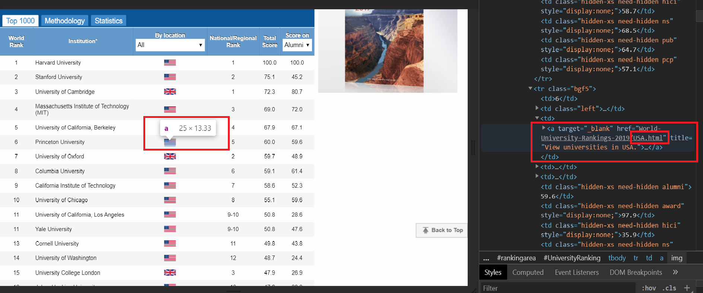

---
authors:
- admin
categories: [Python, webscraping]
date: "2020-01-13"
draft: false
featured: true
image:
  caption: ""
  focal_point: ""
projects: []
subtitle: 
summary: Using Pandas and Beautifulsoup to scrape the Shangai Ranking
tags: [Python]
title: Scrape the Shangai Ranking with Python
---


# Scrape the Shangai Ranking with Python

## About 
The Academic Ranking of World Universities (ARWU) was first published in June 2003 by the Center for World-Class Universities (CWCU), Graduate School of Education (formerly the Institute of Higher Education) of Shanghai Jiao Tong University, China, and updated on an annual basis. Since 2009 the Academic Ranking of World Universities (ARWU) has been published and copyrighted by ShanghaiRanking Consultancy. ShanghaiRanking Consultancy is a fully independent organization on higher education intelligence and not legally subordinated to any universities or government agencies.

ARWU uses six objective indicators to rank world universities, including the number of alumni and staff winning Nobel Prizes and Fields Medals, number of highly cited researchers selected by Clarivate Analytics, number of articles published in journals of Nature and Science, number of articles indexed in Science Citation Index - Expanded and Social Sciences Citation Index, and per capita performance of a university. More than 1800 universities are actually ranked by ARWU every year and the best 1000 are published.

## Goals 
In this post I will demonstrate how you can get the latest ranking dataset from the official website of the Shangai Ranking using Pandas and bs4.


```python
# Import the libraries
import pandas as pd
import requests
from bs4 import BeautifulSoup
```

Let's use the `read_html` function of Pandas to scrape the main the table available at the address __http://www.shanghairanking.com/arwu2019.html__


```python
shangai_ranking = pd.read_html("http://www.shanghairanking.com/arwu2019.html")
```


```python
type(shangai_ranking)
```


    list


It returns a list of 1 element.
We can take a look at the data we just scraped.


```python
shangai_ranking[0].head()
```


<div>
<style scoped>
    .dataframe tbody tr th:only-of-type {
        vertical-align: middle;
    }

    .dataframe tbody tr th {
        vertical-align: top;
    }

    .dataframe thead th {
        text-align: right;
    }
</style>
<table border="1" class="dataframe">
  <thead>
    <tr style="text-align: right;">
      <th></th>
      <th>World Rank</th>
      <th>Institution*</th>
      <th>By location  All Argentina Australia Austria Belgium Brazil Bulgaria Canada Chile China China-Hong Kong China-Macau China-Taiwan Colombia Croatia Cyprus Czech Republic Denmark Egypt Estonia Finland France Germany Greece Hungary Iceland India Iran Ireland Israel Italy Japan Lebanon Lithuania Luxembourg Malaysia Mexico Netherlands New Zealand Nigeria Norway Oman Pakistan Poland Portugal Romania Russia Saudi Arabia Serbia Singapore Slovakia Slovenia South Africa South Korea Spain Sweden Switzerland Thailand Tunisia Turkey United Kingdom United Arab Emirates Uruguay United States Vietnam</th>
      <th>National/Regional Rank</th>
      <th>Total Score</th>
      <th>Score on  Alumni  Award  HiCi  N&amp;S  PUB  PCP</th>
    </tr>
  </thead>
  <tbody>
    <tr>
      <th>0</th>
      <td>1</td>
      <td>Harvard University</td>
      <td>NaN</td>
      <td>1</td>
      <td>100.0</td>
      <td>100.0</td>
    </tr>
    <tr>
      <th>1</th>
      <td>2</td>
      <td>Stanford University</td>
      <td>NaN</td>
      <td>2</td>
      <td>75.1</td>
      <td>45.2</td>
    </tr>
    <tr>
      <th>2</th>
      <td>3</td>
      <td>University of Cambridge</td>
      <td>NaN</td>
      <td>1</td>
      <td>72.3</td>
      <td>80.7</td>
    </tr>
    <tr>
      <th>3</th>
      <td>4</td>
      <td>Massachusetts Institute of Technology (MIT)</td>
      <td>NaN</td>
      <td>3</td>
      <td>69.0</td>
      <td>72.0</td>
    </tr>
    <tr>
      <th>4</th>
      <td>5</td>
      <td>University of California, Berkeley</td>
      <td>NaN</td>
      <td>4</td>
      <td>67.9</td>
      <td>67.1</td>
    </tr>
  </tbody>
</table>
</div>


Most of the columns have been correctly scraped by the `pd.read_html()` function. However the column indicating the countries is not showing because the country names are not mentioned on the website. Only the flags are shown instead. We need to come up with a strategy to scrape that missing column.  
First we will scrape the entire page then we will use Beautiful class to parse the HTML. After parsing the HTML, we will then look for all `` HTML tags and retrieve the string (text) used to describe to describe each flags. This string is the country name.  
As a matter of illustration this is how the site stores the titles of the flags.


Now that we have a clear idea on how the site stores the flags name we can scrape that particular information.


```python
flags = requests.get("http://www.shanghairanking.com/arwu2019.html")
```


```python
soup = BeautifulSoup(flags.text)
```


```python
img_src = soup.find_all("img")[1:1001]
img_src = [str(img) for img in img_src]
img_src = [img.split("/")[2].split(".")[0] for img in img_src]
```

Let's display the first 10 element of that list.


```python
img_src[0:10]
```


    ['USA', 'USA', 'UK', 'USA', 'USA', 'USA', 'UK', 'USA', 'USA', 'USA']


We can now transform the img list to a Pandas Series object and let it replace the previous column.


```python
shangai_ranking[0].iloc[:, 2] = pd.Series(name = "country", data = img_src)
```

As we saw earlier, the name of the third column is not also available, so we need to rename it.


```python
shangai_ranking_ = shangai_ranking[0].rename(columns = {shangai_ranking[0].columns[2]: "country"})
```


```python
shangai_ranking_.head()
```


<div>
<style scoped>
    .dataframe tbody tr th:only-of-type {
        vertical-align: middle;
    }

    .dataframe tbody tr th {
        vertical-align: top;
    }

    .dataframe thead th {
        text-align: right;
    }
</style>
<table border="1" class="dataframe">
  <thead>
    <tr style="text-align: right;">
      <th></th>
      <th>World Rank</th>
      <th>Institution*</th>
      <th>country</th>
      <th>National/Regional Rank</th>
      <th>Total Score</th>
      <th>Score on  Alumni  Award  HiCi  N&amp;S  PUB  PCP</th>
    </tr>
  </thead>
  <tbody>
    <tr>
      <th>0</th>
      <td>1</td>
      <td>Harvard University</td>
      <td>USA</td>
      <td>1</td>
      <td>100.0</td>
      <td>100.0</td>
    </tr>
    <tr>
      <th>1</th>
      <td>2</td>
      <td>Stanford University</td>
      <td>USA</td>
      <td>2</td>
      <td>75.1</td>
      <td>45.2</td>
    </tr>
    <tr>
      <th>2</th>
      <td>3</td>
      <td>University of Cambridge</td>
      <td>UK</td>
      <td>1</td>
      <td>72.3</td>
      <td>80.7</td>
    </tr>
    <tr>
      <th>3</th>
      <td>4</td>
      <td>Massachusetts Institute of Technology (MIT)</td>
      <td>USA</td>
      <td>3</td>
      <td>69.0</td>
      <td>72.0</td>
    </tr>
    <tr>
      <th>4</th>
      <td>5</td>
      <td>University of California, Berkeley</td>
      <td>USA</td>
      <td>4</td>
      <td>67.9</td>
      <td>67.1</td>
    </tr>
  </tbody>
</table>
</div>


```python
shangai_ranking_.describe(include= "object")
```


<div>
<style scoped>
    .dataframe tbody tr th:only-of-type {
        vertical-align: middle;
    }

    .dataframe tbody tr th {
        vertical-align: top;
    }

    .dataframe thead th {
        text-align: right;
    }
</style>
<table border="1" class="dataframe">
  <thead>
    <tr style="text-align: right;">
      <th></th>
      <th>World Rank</th>
      <th>Institution*</th>
      <th>country</th>
      <th>National/Regional Rank</th>
    </tr>
  </thead>
  <tbody>
    <tr>
      <th>count</th>
      <td>1000</td>
      <td>1000</td>
      <td>1000</td>
      <td>1000</td>
    </tr>
    <tr>
      <th>unique</th>
      <td>87</td>
      <td>1000</td>
      <td>64</td>
      <td>142</td>
    </tr>
    <tr>
      <th>top</th>
      <td>201-300</td>
      <td>University College Dublin</td>
      <td>USA</td>
      <td>1</td>
    </tr>
    <tr>
      <th>freq</th>
      <td>100</td>
      <td>1</td>
      <td>206</td>
      <td>61</td>
    </tr>
  </tbody>
</table>
</div>


# For reproducibility
You may be interested in using all the steps above to scrape the data yourself, so I am going to write a function so that you can just copy and run to get the dataset.


```python
# Import the dependencies
from requests import get
from bs4 import BeautifulSoup
from pandas import read_html

def get_arwu(url = "http://www.shanghairanking.com/arwu2019.html"):
    """This function scrapes the Academic Ranking of 
    World University published by the ShangaiRanking Consultancy
    
    There is no need to provide arguments to the function.
    
    Returns a Pandas Dataframe"""
    # Get the first data
    shangai_ranking = read_html(url)
    flags = get("http://www.shanghairanking.com/arwu2019.html")
    soup = BeautifulSoup(flags.text)
    img_src = soup.find_all("img")[1:1001]
    img_src = [str(img) for img in img_src]
    img_src = [img.split("/")[2].split(".")[0] for img in img_src]
    shangai_ranking[0].iloc[:, 2] = pd.Series(name = "country", data = img_src)
    shangai_ranking_ = shangai_ranking[0].rename(columns = {shangai_ranking[0].columns[2]: "country"})
    return shangai_ranking_
```


```python
arwu_ranking = get_arwu()
```


```python
# The last 10 Institutions
arwu_ranking.tail(10)
```


<div>
<style scoped>
    .dataframe tbody tr th:only-of-type {
        vertical-align: middle;
    }

    .dataframe tbody tr th {
        vertical-align: top;
    }

    .dataframe thead th {
        text-align: right;
    }
</style>
<table border="1" class="dataframe">
  <thead>
    <tr style="text-align: right;">
      <th></th>
      <th>World Rank</th>
      <th>Institution*</th>
      <th>country</th>
      <th>National/Regional Rank</th>
      <th>Total Score</th>
      <th>Score on  Alumni  Award  HiCi  N&amp;S  PUB  PCP</th>
    </tr>
  </thead>
  <tbody>
    <tr>
      <th>990</th>
      <td>901-1000</td>
      <td>University of Tabriz</td>
      <td>Iran</td>
      <td>11-13</td>
      <td>NaN</td>
      <td>0.0</td>
    </tr>
    <tr>
      <th>991</th>
      <td>901-1000</td>
      <td>University of Thessaly</td>
      <td>Greece</td>
      <td>6-7</td>
      <td>NaN</td>
      <td>0.0</td>
    </tr>
    <tr>
      <th>992</th>
      <td>901-1000</td>
      <td>University of Toyama</td>
      <td>Japan</td>
      <td>34-43</td>
      <td>NaN</td>
      <td>0.0</td>
    </tr>
    <tr>
      <th>993</th>
      <td>901-1000</td>
      <td>University of Yamanashi</td>
      <td>Japan</td>
      <td>34-43</td>
      <td>NaN</td>
      <td>11.2</td>
    </tr>
    <tr>
      <th>994</th>
      <td>901-1000</td>
      <td>Vellore Institute of Technology</td>
      <td>India</td>
      <td>11-16</td>
      <td>NaN</td>
      <td>0.0</td>
    </tr>
    <tr>
      <th>995</th>
      <td>901-1000</td>
      <td>Williams College</td>
      <td>USA</td>
      <td>193-206</td>
      <td>NaN</td>
      <td>18.6</td>
    </tr>
    <tr>
      <th>996</th>
      <td>901-1000</td>
      <td>Worcester Polytechnic Institute</td>
      <td>USA</td>
      <td>193-206</td>
      <td>NaN</td>
      <td>0.0</td>
    </tr>
    <tr>
      <th>997</th>
      <td>901-1000</td>
      <td>Wroclaw University of Technology</td>
      <td>Poland</td>
      <td>7-9</td>
      <td>NaN</td>
      <td>0.0</td>
    </tr>
    <tr>
      <th>998</th>
      <td>901-1000</td>
      <td>Yokohama National University</td>
      <td>Japan</td>
      <td>34-43</td>
      <td>NaN</td>
      <td>0.0</td>
    </tr>
    <tr>
      <th>999</th>
      <td>901-1000</td>
      <td>Zagazig University</td>
      <td>Egypt</td>
      <td>5</td>
      <td>NaN</td>
      <td>0.0</td>
    </tr>
  </tbody>
</table>
</div>


# To cite this article
To cite this article, please use the following :
Gailloty, A (2019, January 13)., *Scrape the Shangai Ranking with Python*, retrieved from https://agailloty.rbind.io/en/post/shangai-ranking/

