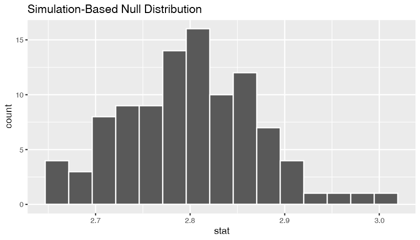

---
authors:
- admin
categories: [R,tidymodels]
date: "2019-09-31"
draft: false
featured: true
image:
  caption: ""
  focal_point: ""
projects: [tidymodels]
subtitle: 
summary: A dive in the new galaxy called tidymodels which surprisingly resembles a lot the known tidyverse galaxy !
tags: [R, tidyverse]
title: Discovering the tidymodels
---
After 1 year and half using the tidyverse ecosystem for data science I can say today that I'm familiar with the some core packages of ecosystem whether it be for data import, manipulation and transformation with `{readr}, {dplyr} and {tidyr}`, for data visualization with `{ggplot2}`, for functional programming with `{purrr}`, for working with strings and date with `{stringr} and {lubridate}`.   


The few packages I just mentioned are in fact only a subset of the whole tidyverse ecosystem. Many other packages are in the tidyverse that I have never used.    

The exhaustive list of all the packages in the tidyverse installation is the following :


```R
tidyverse::tidyverse_packages()
```


<ol class=list-inline>
	<li>'broom'</li>
	<li>'cli'</li>
	<li>'crayon'</li>
	<li>'dplyr'</li>
	<li>'dbplyr'</li>
	<li>'forcats'</li>
	<li>'ggplot2'</li>
	<li>'haven'</li>
	<li>'hms'</li>
	<li>'httr'</li>
	<li>'jsonlite'</li>
	<li>'lubridate'</li>
	<li>'magrittr'</li>
	<li>'modelr'</li>
	<li>'purrr'</li>
	<li>'readr'</li>
	<li>'readxl\n(&gt;='</li>
	<li>'reprex'</li>
	<li>'rlang'</li>
	<li>'rstudioapi'</li>
	<li>'rvest'</li>
	<li>'stringr'</li>
	<li>'tibble'</li>
	<li>'tidyr'</li>
	<li>'xml2'</li>
	<li>'tidyverse'</li>
</ol>


In this blog post I would like to present my recent discovery of the `{tidymodels}`.   
The tidymodels, like the tidyverse, is a meta package containing various packages designed to work together for various modelling tasks in R.  
You will need to install the package before you use it. 


```R
# install.packages("tidymodels")
```

Let's understand what happens to an R session when we load the {tidymodels} package.  
Whenever we start an R session, some packages and namespaces are automatically loaded. We can use the `search()` function to get the names of packages or environments that are attached to the session.


```R
search()
```


<ol class=list-inline>
	<li>'.GlobalEnv'</li>
	<li>'jupyter:irkernel'</li>
	<li>'package:stats'</li>
	<li>'package:graphics'</li>
	<li>'package:grDevices'</li>
	<li>'package:utils'</li>
	<li>'package:datasets'</li>
	<li>'package:methods'</li>
	<li>'Autoloads'</li>
	<li>'package:base'</li>
</ol>


```R
# library(tidymodels)
```

After we load the tidymodels meta package, here are the packages and environment attached to the R session.


```R
search()
```


<ol class=list-inline>
	<li>'.GlobalEnv'</li>
	<li>'package:yardstick'</li>
	<li>'package:tibble'</li>
	<li>'package:rsample'</li>
	<li>'package:tidyr'</li>
	<li>'package:recipes'</li>
	<li>'package:purrr'</li>
	<li>'package:parsnip'</li>
	<li>'package:infer'</li>
	<li>'package:ggplot2'</li>
	<li>'package:dplyr'</li>
	<li>'package:dials'</li>
	<li>'package:scales'</li>
	<li>'package:broom'</li>
	<li>'package:tidymodels'</li>
	<li>'jupyter:irkernel'</li>
	<li>'package:stats'</li>
	<li>'package:graphics'</li>
	<li>'package:grDevices'</li>
	<li>'package:utils'</li>
	<li>'package:datasets'</li>
	<li>'package:methods'</li>
	<li>'Autoloads'</li>
	<li>'package:base'</li>
</ol>


It loads some of the most used packages of the tidyverse such as `{dplyr}, {tidyr}, {purrr}` along with the modelling packages.   
The goal of this article is to present each of these packages : for what they are used for and present their main functions.

# 1 - `{yardstick}`


This package contains functions to estimate how well models are working using tidy principles. It is the package you'll need to use when you want to compute the root mean squared error (RMSE), the accuracy, the precision, the recall ... It has over 70 functions just to test your models.  
The nice thing about the package is that it outputs data frames.

## Demo of some functions
As many R packages, yardstick comes with examples data set to test the functions. One of the dataset is `two_class_example`.


```R
metrics(two_class_example, truth, predicted)
```


<table>
<thead><tr><th scope=col>.metric</th><th scope=col>.estimator</th><th scope=col>.estimate</th></tr></thead>
<tbody>
	<tr><td>accuracy </td><td>binary   </td><td>0.8380000</td></tr>
	<tr><td>kap      </td><td>binary   </td><td>0.6748764</td></tr>
</tbody>
</table>


```R
precision(two_class_example, truth = truth, estimate = predicted)
```


<table>
<thead><tr><th scope=col>.metric</th><th scope=col>.estimator</th><th scope=col>.estimate</th></tr></thead>
<tbody>
	<tr><td>precision</td><td>binary   </td><td>0.8194946</td></tr>
</tbody>
</table>


Because all the outputs are data frame you can easily bind them.


```R
rbind(
    metrics(two_class_example, truth, predicted),
    precision(two_class_example, truth = truth, estimate = predicted),
    recall(two_class_example, truth = truth, estimate = predicted)
)
```


<table>
<thead><tr><th scope=col>.metric</th><th scope=col>.estimator</th><th scope=col>.estimate</th></tr></thead>
<tbody>
	<tr><td>accuracy </td><td>binary   </td><td>0.8380000</td></tr>
	<tr><td>kap      </td><td>binary   </td><td>0.6748764</td></tr>
	<tr><td>precision</td><td>binary   </td><td>0.8194946</td></tr>
	<tr><td>recall   </td><td>binary   </td><td>0.8798450</td></tr>
</tbody>
</table>


```R
sample(
lsf.str("package:yardstick"), size = 10 )
```


<ol class=list-inline>
	<li>'detection_prevalence_vec'</li>
	<li>'bal_accuracy_vec'</li>
	<li>'rmse'</li>
	<li>'huber_loss_pseudo'</li>
	<li>'mape'</li>
	<li>'mcc'</li>
	<li>'roc_auc'</li>
	<li>'metric_vec_template'</li>
	<li>'smape_vec'</li>
	<li>'roc_auc_vec'</li>
</ol>


# 2- {rsample}


The rsample package provides the infrastructure for data splitting and resampling.

**rsample contains a set of functions that can create different types of resamples and corresponding classes for their analysis. The goal is to have a modular set of methods that can be used across different R packages for:**

• traditional resampling techniques for estimating the sampling distribution of a statistic and  
• estimating model performance using a holdout set

* The scope of rsample is to provide the basic building blocks for creating and analyzing resamples of a data set but does not include code for modeling or calculating statistics (which is left to other tidymodels or R packages)

Some resampling methods include: Simple Training/Test Set Splitting, Bootstrap Sampling, V-Fold Cross-Validation (CV), Leave-One-Out CV, Monte Carlo CV, Group V-Fold CV, Rolling Origin Forecast Resampling, Nested or Double Resampling, and Sampling for the Apparent Error Rate.


## Demo

**Splitting a data set into training and testing sets**


```R
splits <- initial_split(data = iris, prop = .7)
```


```R
train <- training(splits)
test <- testing(splits)

print(
    paste(
    "The data set is splitted into training set of", nrow(train),
        "rows and a testing of", nrow(test), "rows."))
```

    [1] "The data set is splitted into training set of 105 rows and a testing of 45 rows."
    

**Bootstrap resampling**  
A bootstrap sample is a sample that is the same size as the original data set that is made using replacement. This results in analysis samples that have multiple replicates of some of the original rows of the data. The assessment set is defined as the rows of the original data that were not included in the bootstrap sample. This is often referred to as the "out-of-bag" (OOB) sample.

For the demonstration purpose let's say we want to have a assess the confidence interval of a linear regression model.


```R
confint(lm(mpg ~ wt, data = mtcars), level = .90)
```


<table>
<thead><tr><th></th><th scope=col>5 %</th><th scope=col>95 %</th></tr></thead>
<tbody>
	<tr><th scope=row>(Intercept)</th><td>34.098303</td><td>40.471950</td></tr>
	<tr><th scope=row>wt</th><td>-6.293412</td><td>-4.395531</td></tr>
</tbody>
</table>


```R
boot <- bootstraps(mtcars, 100)

confidence_intervals <- map(boot$splits, ~ confint(lm(mpg ~ wt, data = .), level = .90))
```


```R
confidence_intervals[1:5]
```


<ol>
	<li><table>
<thead><tr><th></th><th scope=col>5 %</th><th scope=col>95 %</th></tr></thead>
<tbody>
	<tr><th scope=row>(Intercept)</th><td>32.556379</td><td>38.914256</td></tr>
	<tr><th scope=row>wt</th><td>-5.790271</td><td>-4.055817</td></tr>
</tbody>
</table>
</li>
	<li><table>
<thead><tr><th></th><th scope=col>5 %</th><th scope=col>95 %</th></tr></thead>
<tbody>
	<tr><th scope=row>(Intercept)</th><td>34.632854</td><td>39.825161</td></tr>
	<tr><th scope=row>wt</th><td>-6.309371</td><td>-4.653124</td></tr>
</tbody>
</table>
</li>
	<li><table>
<thead><tr><th></th><th scope=col>5 %</th><th scope=col>95 %</th></tr></thead>
<tbody>
	<tr><th scope=row>(Intercept)</th><td>26.893473</td><td>33.9626  </td></tr>
	<tr><th scope=row>wt</th><td>-4.540461</td><td>-2.6207  </td></tr>
</tbody>
</table>
</li>
	<li><table>
<thead><tr><th></th><th scope=col>5 %</th><th scope=col>95 %</th></tr></thead>
<tbody>
	<tr><th scope=row>(Intercept)</th><td>35.056813</td><td>40.567585</td></tr>
	<tr><th scope=row>wt</th><td>-6.372533</td><td>-4.699671</td></tr>
</tbody>
</table>
</li>
	<li><table>
<thead><tr><th></th><th scope=col>5 %</th><th scope=col>95 %</th></tr></thead>
<tbody>
	<tr><th scope=row>(Intercept)</th><td>36.526476</td><td>44.87956 </td></tr>
	<tr><th scope=row>wt</th><td>-7.697699</td><td>-5.19452 </td></tr>
</tbody>
</table>
</li>
</ol>


# 3- {recipes}

The recipes package is an alternative method for creating and preprocessing design matrices that can be used for modeling or visualization. The recipes package lets you automate your preprocessing routine with useful step functions.   

The package consists of three major function and family of functions.  

- recipe() : this functions lets you specify the design matrix. Think of the design matrix as the matrix of features that will be fed into a model.   

- step_*() family of functions : these are functions that will be applied sequentially on the design matrix you specified  

- prep() : this function perform the computation specified by the step_*() functions and return the final design matrix.  

- bake() : this function lets you apply the blueprint you create on a new data set.   

## Demo
**Create a design matrix from the state.x77 dataset**


```R
state <- datasets::state.x77
colnames(state) <- gsub(pattern = " ", replacement = "_", x = colnames(state))
head(state)
```


<table>
<thead><tr><th></th><th scope=col>Population</th><th scope=col>Income</th><th scope=col>Illiteracy</th><th scope=col>Life_Exp</th><th scope=col>Murder</th><th scope=col>HS_Grad</th><th scope=col>Frost</th><th scope=col>Area</th></tr></thead>
<tbody>
	<tr><th scope=row>Alabama</th><td> 3615 </td><td>3624  </td><td>2.1   </td><td>69.05 </td><td>15.1  </td><td>41.3  </td><td> 20   </td><td> 50708</td></tr>
	<tr><th scope=row>Alaska</th><td>  365 </td><td>6315  </td><td>1.5   </td><td>69.31 </td><td>11.3  </td><td>66.7  </td><td>152   </td><td>566432</td></tr>
	<tr><th scope=row>Arizona</th><td> 2212 </td><td>4530  </td><td>1.8   </td><td>70.55 </td><td> 7.8  </td><td>58.1  </td><td> 15   </td><td>113417</td></tr>
	<tr><th scope=row>Arkansas</th><td> 2110 </td><td>3378  </td><td>1.9   </td><td>70.66 </td><td>10.1  </td><td>39.9  </td><td> 65   </td><td> 51945</td></tr>
	<tr><th scope=row>California</th><td>21198 </td><td>5114  </td><td>1.1   </td><td>71.71 </td><td>10.3  </td><td>62.6  </td><td> 20   </td><td>156361</td></tr>
	<tr><th scope=row>Colorado</th><td> 2541 </td><td>4884  </td><td>0.7   </td><td>72.06 </td><td> 6.8  </td><td>63.9  </td><td>166   </td><td>103766</td></tr>
</tbody>
</table>


For this demo, let's say we want to explain life expentancy as a function of all the variables. We want our model to have the following specifications :
- Taking the logarithm of the dependant variable 
- Standardize all the feature columns
- Have polynomial degrees of 2 for Income and Illiteracy


```R
blueprint <- recipe(formula = Life_Exp  ~ . , data = state)
```


```R
blueprint <- blueprint %>%
step_log(all_outcomes()) %>%
step_scale(all_predictors()) %>%
step_poly(Income, Illiteracy, options = list(degree = 2))
```


```R
blueprint
```


    Data Recipe
    
    Inputs:
    
          role #variables
       outcome          1
     predictor          7
    
    Operations:
    
    Log transformation on all_outcomes()
    Scaling for all_predictors()
    Orthogonal polynomials on Income, Illiteracy


```R
blueprint <- prep(blueprint)
```


```R
head(blueprint$template)
```


<table>
<thead><tr><th scope=col>Population</th><th scope=col>Murder</th><th scope=col>HS_Grad</th><th scope=col>Frost</th><th scope=col>Area</th><th scope=col>Life_Exp</th><th scope=col>Income_poly_1</th><th scope=col>Income_poly_2</th><th scope=col>Illiteracy_poly_1</th><th scope=col>Illiteracy_poly_2</th></tr></thead>
<tbody>
	<tr><td>0.80972269   </td><td>4.090434     </td><td>5.113286     </td><td>0.3847571    </td><td>0.5942764    </td><td>4.234831     </td><td>-0.18873410  </td><td> 0.0983672744</td><td> 0.21796542  </td><td> 0.01105159  </td></tr>
	<tr><td>0.08175623   </td><td>3.061053     </td><td>8.258019     </td><td>2.9241539    </td><td>6.6383444    </td><td>4.238589     </td><td> 0.43689223  </td><td> 0.7305725135</td><td> 0.07734257  </td><td>-0.17129700  </td></tr>
	<tr><td>0.49546517   </td><td>2.112939     </td><td>7.193267     </td><td>0.2885678    </td><td>1.3291995    </td><td>4.256322     </td><td> 0.02190041  </td><td>-0.0933766675</td><td> 0.14765400  </td><td>-0.11655040  </td></tr>
	<tr><td>0.47261822   </td><td>2.735986     </td><td>4.939954     </td><td>1.2504606    </td><td>0.6087735    </td><td>4.257880     </td><td>-0.24592625  </td><td> 0.2213291785</td><td> 0.17109114  </td><td>-0.08211145  </td></tr>
	<tr><td>4.74813320   </td><td>2.790164     </td><td>7.750404     </td><td>0.3847571    </td><td>1.8324850    </td><td>4.272630     </td><td> 0.15767364  </td><td> 0.0007233293</td><td>-0.01640600  </td><td>-0.13096185  </td></tr>
	<tr><td>0.56915777   </td><td>1.842050     </td><td>7.911355     </td><td>3.1934839    </td><td>1.2160938    </td><td>4.277499     </td><td> 0.10420131  </td><td>-0.0567062476</td><td>-0.11015457  </td><td> 0.03889401  </td></tr>
</tbody>
</table>


From here you can use this design matrix to estimate your model !

## 4- {parsnip}

The parsnip "is designed to solve a specific problem related to model fitting in #r, the interface. Many functions have different interfaces and argument names and parsnip standardizes the interface for fitting models as well as the return values. When using parsnip, you don’t have to remember each interface and its unique set of argument names to easily move between R packages".

parsnip is a tidy, unified interface to models that can be used to try a range of models without getting bogged down in the syntactical minutiae of the underlying package. The idea is:

• Separate the definition of a model from its evaluation.

• Decouple the model specification from the implementation (whether the implementation is in R, #spark, or something else). For example, the user would call rand_forest() instead of ranger::ranger() or other specific packages.

• Harmonize the argument names (e.g. n.trees, ntrees, trees) so that users can remember a single name. This will help across model types too so that trees will be the same argument across random forest as well as boosting or bagging.

## Demo
**Fit a regularized regression**


```R
constrained_reg <- linear_reg(mode = "regression", penalty = .8, mixture = 1) %>%
set_engine(engine = "glmnet")
```


```R
constrained_reg
```


    Linear Regression Model Specification (regression)
    
    Main Arguments:
      penalty = 0.8
      mixture = 1
    
    Computational engine: glmnet 
    


```R
translate(constrained_reg, engine = "glmnet")
```


    Linear Regression Model Specification (regression)
    
    Main Arguments:
      penalty = 0.8
      mixture = 1
    
    Computational engine: glmnet 
    
    Model fit template:
    glmnet::glmnet(x = missing_arg(), y = missing_arg(), weights = missing_arg(), 
        lambda = 0.8, alpha = 1, family = "gaussian")


```R
results <- fit(constrained_reg, formula = Life_Exp ~ . , data = blueprint$template)
```

## 5- {infer}

The objective of this package is to perform statistical inference using an expressive statistical grammar that coheres with the tidyverse design framework. In short this package aims to make statistical inference tidy and transparent. 
The process can be summarize with the following diagram :


## Demo

Let's demo an example to understand how it is working
We want to test if there's a significant difference between petal length of a setosa and of a versicolor


```R
options(repr.plot.height = 4)

iris %>% filter(Species %in% c("setosa", "versicolor")) %>%
mutate(Species = as.factor(Species)) %>%
  specify(response = Petal.Length, explanatory = Species) %>%
  generate(reps = 100, type = "bootstrap") %>%
  calculate(stat = "diff in means", , order = c("versicolor", "setosa")) %>%
visualize()
```





# 5- {dials}

This package contains tools to create and manage values of tuning parameters and is designed to integrate well with the parsnip package.

The name reflects the idea that tuning predictive models can be like turning a set of dials on a complex machine under duress.
