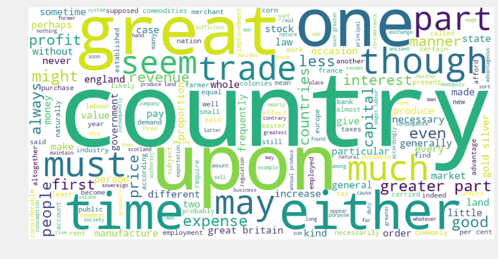
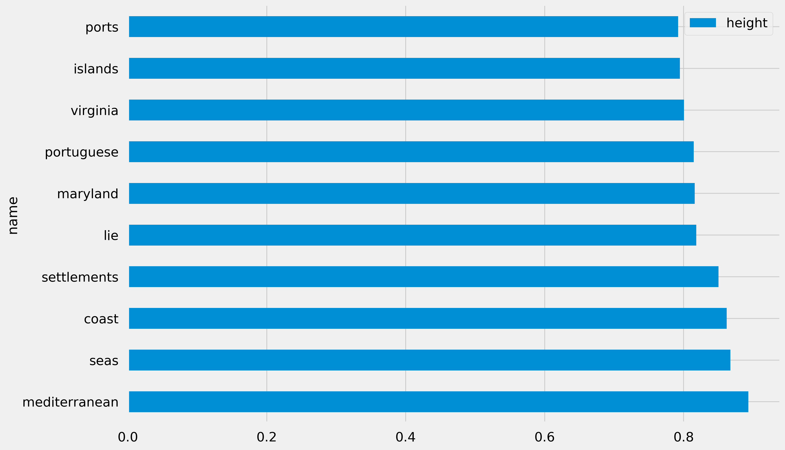
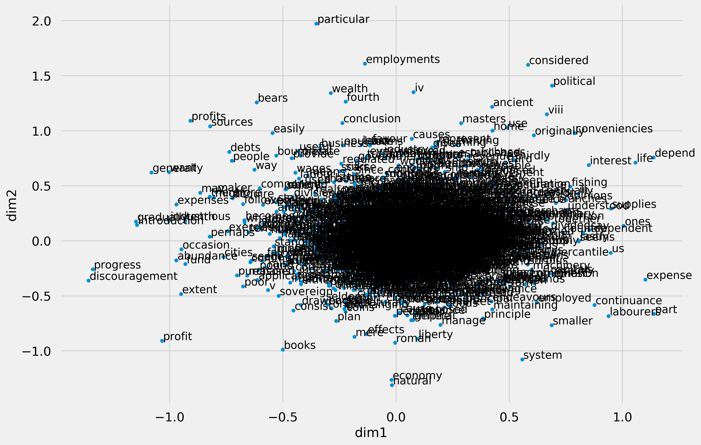
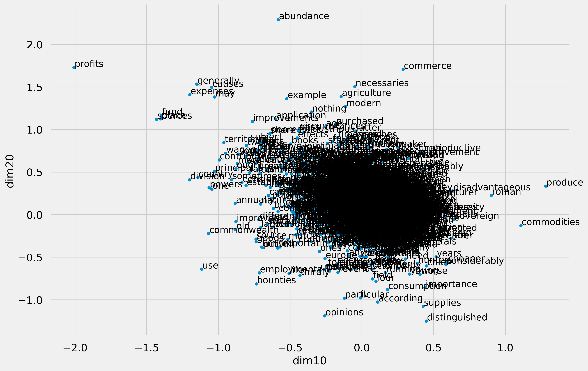
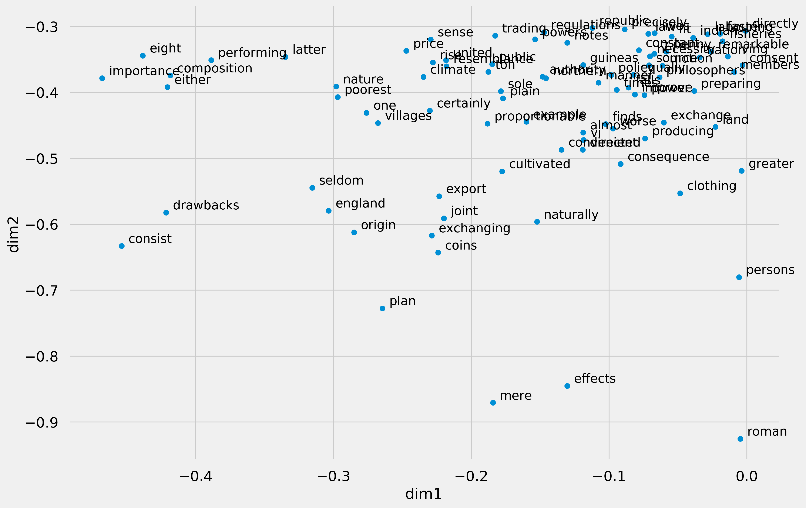
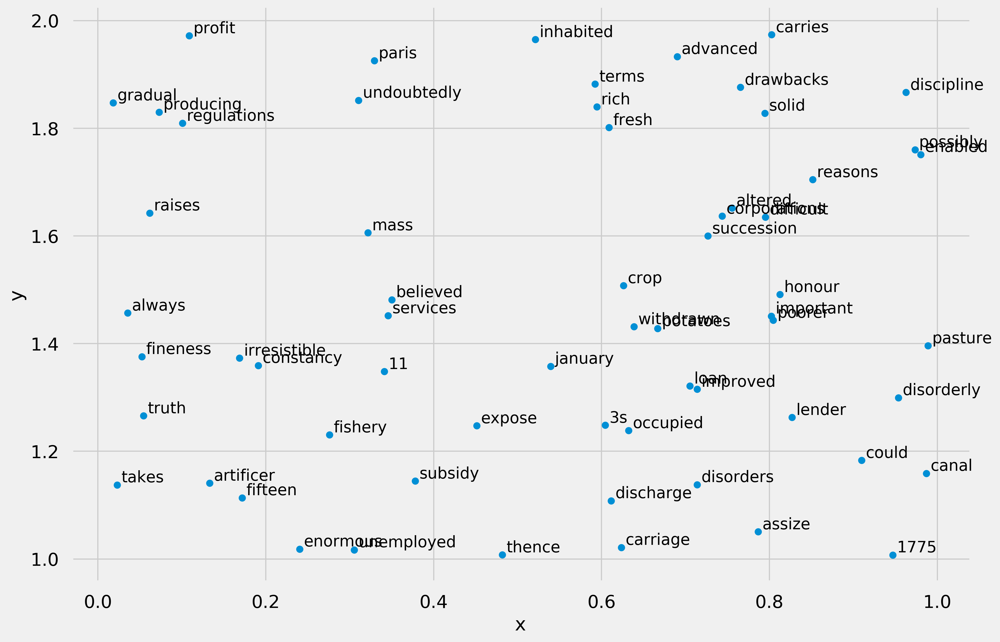
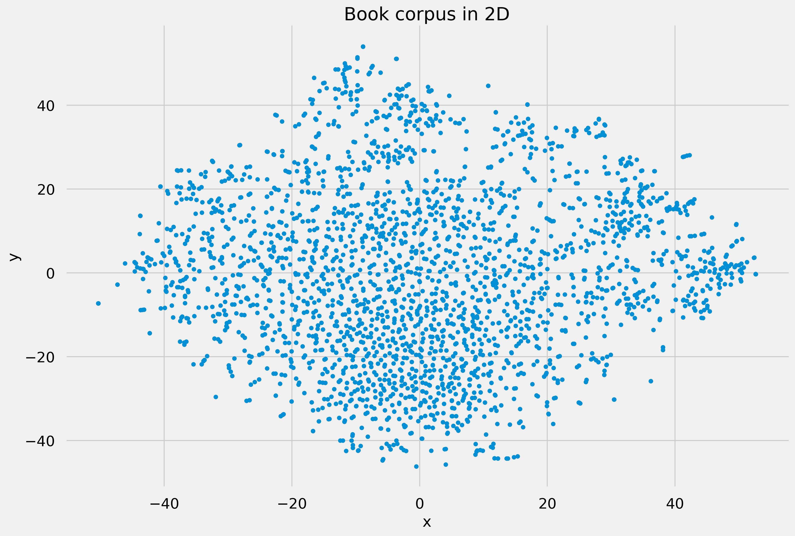
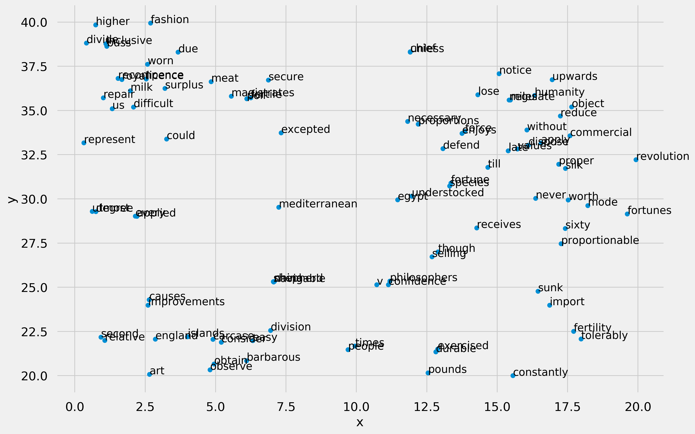

# Introduction


An Inquiry into the Nature and Causes of the Wealth of Nations, generally referred to by its shortened title The Wealth of Nations, is the magnum opus of the Scottish economist and moral philosopher Adam Smith. First published in 1776, the book offers one of the world's first collected descriptions of what builds nations' wealth, and is today a fundamental work in classical economics. By reflecting upon the economics at the beginning of the Industrial Revolution, the book touches upon such broad topics as the division of labour, productivity, and free markets.

# What is this kernel for ?
You may wonder why I am using Smith's book here. 
For this project my goal is to apply **Natural Language Processing** techniques to analyse and extract insights in the book. 
This book is very referred in the Economic Litterature but few of the people who cited it have actually read it. In this project I would like to study the core thoughts of Adam Smith

# Text reading and cleaning
From now I am going to read the text in memory and analyse it. 
The text is freely available on the [Project Gutenberg website](https://www.gutenberg.org/ebooks/3300). I downloaded it in text format beforehand and uploaded on Kaggle.  
Project Gutenberg was the first provider of free electronic books, or eBooks. Michael Hart, founder of Project Gutenberg, invented eBooks in 1971 and his memory continues to inspire the creation of eBooks and related technologies today.

## Reading it with `open()`
The built-in `open()` function helps us read the text. We are going to open it in read mode.


```python
text_path = "../input/an-inquiry-into-the-nature-and-causes-of-wealth/An Inquiry.txt"
raw_text = open(text_path, "r").read()
```


```python
type(raw_text), len(raw_text)
```


    (str, 2441535)


We assign the content of the text to the raw_text variable. From here we can have a glimpse of the text. 
Notice that Python reads the text as a large single string. 
From now what we can do with the text is to slice some part of it to display. For example we can print the thousand first characters for sanity check.


```python
print(raw_text[0:1000])
```

    
    The Project Gutenberg EBook of An Inquiry into the Nature and Causes of
    the Wealth of Nations, by Adam Smith
    
    This eBook is for the use of anyone anywhere at no cost and with
    almost no restrictions whatsoever.  You may copy it, give it away or
    re-use it under the terms of the Project Gutenberg License included
    with this eBook or online at www.gutenberg.org
    
    
    Title: An Inquiry into the Nature and Causes of the Wealth of Nations
    
    Author: Adam Smith
    
    Release Date: February 28, 2009 [EBook #3300]
    Last Updated: September 7, 2019
    
    Language: English
    
    Character set encoding: UTF-8
    
    *** START OF THIS PROJECT GUTENBERG EBOOK NATURE AND CAUSES OF THE WEALTH OF NATIONS ***
    
    
    
    
    Produced by Colin Muir, and David Widger
    
    
    
    An Inquiry into the Nature and Causes of the Wealth of Nations
    
    
    
    by Adam Smith
    
    
    
    
    
    Contents
    
    
     INTRODUCTION AND PLAN OF THE WORK.
    
     BOOK I. OF THE CAUSES OF IMPROVEMENT IN THE PRODUCTIVE
    POWERS OF LABOUR, AND OF THE ORDER ACCORDING TO WHICH ITS PRODUCE IS NATURALLY
    DISTRIBUTED A
    

As we see in this slice of the string, there are meta information provided by the Project Gutenberg in the beginning of the book. These information are not part of the original book, so we will remove them. To do so we are reading the text from the 719th index.  
The last 18868 characters are also legal disclaimers added by the Project Gutenberg, so I will also remove them to have the text only.


```python
text = raw_text[719:-18868]
```

Since the text is read as a big string object we cannot really exploit it. To make it exploitable we need to tokenize the text.  
There are two methods to tokenize the text : 
- we can tokenize sentences or   
- tokenize tokens (words, punctuation ...). 

# EXPLORATORY DATA ANALYSIS

In the first part of this project I want to explore the text in an statiscal fashion. So I will tokenize the text such that I can count the occurence of every token (word) used in the corpus.


```python
from nltk.tokenize import word_tokenize
```


```python
all_tokens = word_tokenize(text)
```

The `word_tokenize()` function returns a list containing all the tokens that are in the corpus. Let's have a glance.


```python
all_tokens[1:10]
```


    ['Inquiry', 'into', 'the', 'Nature', 'and', 'Causes', 'of', 'the', 'Wealth']


Now every token is represented as an element of the list. The advantage is that we can count the occurence of every token.  
But it is likely that punctuations and stop words are the most frequent words in the corpus. 


```python
from collections import Counter
```


```python
token_counts = Counter(all_tokens)
token_counts.most_common(10)
```


    [(',', 35957),
     ('the', 29135),
     ('of', 24063),
     ('.', 11929),
     ('to', 11588),
     ('and', 10174),
     ('in', 8546),
     ('a', 6169),
     ('which', 4815),
     ('is', 4677)]


We see that `,` is the most frequent word in the corpus. In overall the 10 most common words do not give us any clue on what the text is about. We'll need to clean it before visualizing the text.

## Remove punctuations & stopwords

An easy way to remove punctuations in the list of the tokens is to use the `.isalpha()` method of the string class. Knowing that we can filter the list to keep only alphanumeric tokens.


```python
# An example
"work".isalpha(), ",".isalpha()
```


    (True, False)


```python
alpha_tokens = [word for word in all_tokens if word.isalpha()]
len(all_tokens), len(alpha_tokens)
```


    (433093, 377038)


```python
token_counts = Counter(alpha_tokens)
token_counts.most_common(10)
```


    [('the', 29135),
     ('of', 24063),
     ('to', 11588),
     ('and', 10174),
     ('in', 8546),
     ('a', 6169),
     ('which', 4815),
     ('is', 4677),
     ('it', 4579),
     ('be', 3817)]


Now that we have successfully removed the punctuations, we need to remove the stop words. Stop words are words that do not have a particular meaning. They are used to connect ideas, and making the language smooth. 
The Natural Language Toolkit (nltk) package comes with a list of stopwords in English.   

Before doing so it's important to lower all the tokens. It's a strategy to normalize the text so there's no difference between "The", "the", or "THE".


```python
# An example of stopwords in English
from nltk.corpus import stopwords
stopwords.words("english")[10:20]
```


    ["you've",
     "you'll",
     "you'd",
     'your',
     'yours',
     'yourself',
     'yourselves',
     'he',
     'him',
     'his']


To remove the stopwords in the text we can write a list comprehension. 


```python
# May take a little time to run
alpha_tokens = [word.lower() for word in alpha_tokens]
cleaned_tokens = [word for word in alpha_tokens if not word in stopwords.words("english")]

len(cleaned_tokens), len(alpha_tokens)
```


    (177445, 377038)


```python
token_counts = Counter(cleaned_tokens)
token_counts.most_common(10)
```


    [('upon', 2112),
     ('great', 1582),
     ('part', 1398),
     ('would', 1266),
     ('price', 1262),
     ('country', 1236),
     ('greater', 1085),
     ('one', 1048),
     ('labour', 1010),
     ('much', 1007)]


Now we are ready to go since we've cleaned the tokens.

# VISUALIZATION


```python
%matplotlib inline 
import matplotlib.pyplot as plt

# Configure the way the plots will look
plt.style.use([{
    "figure.dpi": 300,
    "figure.figsize":(12,9),
    "xtick.labelsize": "large",
    "ytick.labelsize": "large",
    "legend.fontsize": "x-large",
    "axes.labelsize": "x-large",
    "axes.titlesize": "xx-large",
    "axes.spines.top": False,
    "axes.spines.right": False,
},'seaborn-poster', "fivethirtyeight"])
```


```python
from wordcloud import WordCloud
str_cleaned_tokens = " ".join(cleaned_tokens) # the word cloud needs raw text as argument not list
wc = WordCloud(background_color="white", width= 800, height= 400).generate(str_cleaned_tokens)
plt.imshow(wc)
plt.axis("off");
```





# MODELLING

So far what we've done is to split the text into tokens that we have studied individually. Even if this technique have given us some insights about the text, it is not enough because we took each token individually as if the book only contains 1262 occurences of price, 1232 occurences of country ignoring all the surroundings of these occurences.  

I want to come up with a technique that captures the surroundings of each token so that I can have a better understanding of the corpus.  
I am going to use a family of word embedding algorithms called word2vec.

These models are shallow, two-layer neural networks that are trained to reconstruct linguistic contexts of words. Word2vec takes as its input a large corpus of text and produces a vector space, typically of several hundred dimensions, with each unique word in the corpus being assigned a corresponding vector in the space. **Word vectors are positioned in the vector space such that words that share common contexts in the corpus are located close to one another in the space**. (Wikipedia)

I will then use the properties of this techniques to visualize the data more accurately.

## Word2vec

The word2vec algorithm is implemented in the `gensim` library. It takes as input a sequence of sequences like this 
```python
[[learning, data, science, good], [data, science, hot, job]]
```

To make our corpus look like a sequence of sequence we'll write some functions to automate the process.  
The functions will :
- lower the text
- remove punctuations
- remove stop words


Remember we say, we can tokenize our text into tokens or into sentences. For the exploratory part we were interested in counting occurences of each token, so we tokenized the text int individual tokens. Here we will tokenize it into sentences.


```python
from nltk.tokenize import sent_tokenize, RegexpTokenizer
```


```python
sentences = sent_tokenize(text)
```

Here's how a sentence looks like.


```python
print(sentences[100])
```

    In those great manufactures, on the contrary, which are destined to supply
          the great wants of the great body of the people, every different branch of
          the work employs so great a number of workmen, that it is impossible to
          collect them all into the same workhouse.
    

As we can read, each sentence contains punctuations, stop words


```python
tokenizer = RegexpTokenizer(r'\w+')

def remove_stopwords(text, stopw = stopwords.words("english")):
    list_of_sentences = []
    
    for sentences in text:
        list_of_words = []
        for word in sentences:
            if not word in stopw:
                list_of_words.append(word)
        list_of_sentences.append(list_of_words)
    return list_of_sentences

def clean_sent(sentences):
    """Sentence must be a list containing string"""
    stopw = stopwords.words("english")
    # Lower each word in each sentence        
    sentences = [tokenizer.tokenize(sent.lower()) for sent in sentences]
    sentences = remove_stopwords(sentences)
    return sentences
```


```python
cleaned_sentences = clean_sent(sentences)
```

Here's how the sentence will look after we apply the function on it.


```python
print(cleaned_sentences[100])
```

    ['great', 'manufactures', 'contrary', 'destined', 'supply', 'great', 'wants', 'great', 'body', 'people', 'every', 'different', 'branch', 'work', 'employs', 'great', 'number', 'workmen', 'impossible', 'collect', 'workhouse']
    

## Fitting the word2vec model. 

Now that the data is prepared we can feed it into the word2vec algorithm.


```python
from gensim.models import Word2Vec
```


```python
model = Word2Vec(
    min_count= 10,# minimum word occurence 
    size = 300, # number of dimensions
    alpha = 0.01, #The initial learning rate
)
```


```python
model.build_vocab(cleaned_sentences)
model.train(cleaned_sentences, total_examples = model.corpus_count, epochs = 60)
```


    (9001661, 11019960)


```python
model.wv.most_similar("wealth")
```


    [('riches', 0.8952459692955017),
     ('greatness', 0.7824883460998535),
     ('advancing', 0.7762885093688965),
     ('population', 0.743035614490509),
     ('declining', 0.7326695919036865),
     ('prosperity', 0.7212557792663574),
     ('poverty', 0.6967371702194214),
     ('declension', 0.6877076625823975),
     ('stationary', 0.6875174641609192),
     ('cause', 0.6550608277320862)]


```python
model.wv.most_similar("france")
```


    [('holland', 0.7928866147994995),
     ('germany', 0.7042788863182068),
     ('england', 0.6981622576713562),
     ('flanders', 0.6687660217285156),
     ('spain', 0.6644077897071838),
     ('switzerland', 0.646226167678833),
     ('scotland', 0.6378161907196045),
     ('union', 0.6369390487670898),
     ('ireland', 0.6296470165252686),
     ('northern', 0.6293553113937378)]


```python
model.wv.most_similar("africa")
```


    [('mediterranean', 0.893129825592041),
     ('seas', 0.8674593567848206),
     ('coast', 0.8618636131286621),
     ('settlements', 0.8501049876213074),
     ('lie', 0.8181817531585693),
     ('maryland', 0.8159624338150024),
     ('portuguese', 0.8145447969436646),
     ('virginia', 0.8005963563919067),
     ('islands', 0.7947076559066772),
     ('ports', 0.7919923067092896)]


```python
import pandas as pd
similar = pd.DataFrame(model.wv.most_similar("africa", topn= 10), columns = ["name", "height"])
```


```python
similar.plot.barh(x = "name", y = "height");
```





```python
model.wv.most_similar("king")
```


    [('william', 0.7854779958724976),
     ('agreed', 0.716715931892395),
     ('chap', 0.7091577649116516),
     ('4th', 0.7072503566741943),
     ('8th', 0.705552339553833),
     ('council', 0.7049906253814697),
     ('queen', 0.7014397382736206),
     ('granting', 0.7006829380989075),
     ('charter', 0.7004244327545166),
     ('poundage', 0.69635009765625)]


Now it would be interesting to visualize all the corpus. 
But first, we can store all the word vectors in a Pandas data frame.


```python
all_words = model.wv.vectors
```


```python
def wv_to_df(model):
    all_wv = model.wv.vectors
    
    df = pd.DataFrame(
        all_wv,
        index = model.wv.vocab.keys(),
        columns = ["dim" + str(i+1) for i in range(all_wv.shape[1])]
    )
    return df
```


```python
df = wv_to_df(model)
```


```python
df.head()
```


<div>
<style scoped>
    .dataframe tbody tr th:only-of-type {
        vertical-align: middle;
    }

    .dataframe tbody tr th {
        vertical-align: top;
    }

    .dataframe thead th {
        text-align: right;
    }
</style>
<table border="1" class="dataframe">
  <thead>
    <tr style="text-align: right;">
      <th></th>
      <th>dim1</th>
      <th>dim2</th>
      <th>dim3</th>
      <th>dim4</th>
      <th>dim5</th>
      <th>dim6</th>
      <th>dim7</th>
      <th>dim8</th>
      <th>dim9</th>
      <th>dim10</th>
      <th>...</th>
      <th>dim291</th>
      <th>dim292</th>
      <th>dim293</th>
      <th>dim294</th>
      <th>dim295</th>
      <th>dim296</th>
      <th>dim297</th>
      <th>dim298</th>
      <th>dim299</th>
      <th>dim300</th>
    </tr>
  </thead>
  <tbody>
    <tr>
      <th>inquiry</th>
      <td>0.048495</td>
      <td>-0.081440</td>
      <td>-0.762516</td>
      <td>-0.274701</td>
      <td>-0.172420</td>
      <td>0.857812</td>
      <td>1.130592</td>
      <td>0.459815</td>
      <td>-0.078941</td>
      <td>0.030419</td>
      <td>...</td>
      <td>-1.160202</td>
      <td>-1.146744</td>
      <td>-0.632318</td>
      <td>-0.421545</td>
      <td>1.302108</td>
      <td>-0.140747</td>
      <td>-0.355008</td>
      <td>0.915122</td>
      <td>0.359754</td>
      <td>-0.206578</td>
    </tr>
    <tr>
      <th>nature</th>
      <td>-0.298017</td>
      <td>-0.391269</td>
      <td>-0.561077</td>
      <td>-0.387724</td>
      <td>-0.421232</td>
      <td>-0.219420</td>
      <td>-0.192597</td>
      <td>0.175413</td>
      <td>1.023236</td>
      <td>-0.331937</td>
      <td>...</td>
      <td>-1.044092</td>
      <td>0.880427</td>
      <td>-0.465193</td>
      <td>0.528811</td>
      <td>0.192186</td>
      <td>0.000533</td>
      <td>-0.126373</td>
      <td>-0.204079</td>
      <td>-0.810000</td>
      <td>0.419142</td>
    </tr>
    <tr>
      <th>causes</th>
      <td>0.069119</td>
      <td>0.926559</td>
      <td>-0.336820</td>
      <td>0.418989</td>
      <td>0.886132</td>
      <td>-0.072440</td>
      <td>-0.781223</td>
      <td>-0.792155</td>
      <td>0.441998</td>
      <td>-1.047452</td>
      <td>...</td>
      <td>0.204383</td>
      <td>-0.585280</td>
      <td>-1.233011</td>
      <td>-0.624585</td>
      <td>-0.246314</td>
      <td>-0.076217</td>
      <td>-0.447358</td>
      <td>-0.009825</td>
      <td>-1.157181</td>
      <td>-0.385364</td>
    </tr>
    <tr>
      <th>wealth</th>
      <td>-0.289020</td>
      <td>1.341782</td>
      <td>0.546315</td>
      <td>0.574780</td>
      <td>0.711534</td>
      <td>1.230310</td>
      <td>0.619434</td>
      <td>-1.721946</td>
      <td>0.535944</td>
      <td>-0.539992</td>
      <td>...</td>
      <td>-0.093015</td>
      <td>0.010880</td>
      <td>0.846309</td>
      <td>-0.214149</td>
      <td>-0.328965</td>
      <td>0.471801</td>
      <td>0.225443</td>
      <td>0.602314</td>
      <td>-0.462304</td>
      <td>-1.344933</td>
    </tr>
    <tr>
      <th>nations</th>
      <td>-0.514426</td>
      <td>0.024197</td>
      <td>-0.772580</td>
      <td>-0.019819</td>
      <td>1.278792</td>
      <td>0.913597</td>
      <td>-0.877698</td>
      <td>-0.692484</td>
      <td>0.616603</td>
      <td>-0.413216</td>
      <td>...</td>
      <td>0.213012</td>
      <td>0.616013</td>
      <td>-0.695652</td>
      <td>-0.070675</td>
      <td>-0.368606</td>
      <td>-0.738947</td>
      <td>0.010722</td>
      <td>-0.272200</td>
      <td>0.063949</td>
      <td>-0.284940</td>
    </tr>
  </tbody>
</table>
<p>5 rows × 300 columns</p>
</div>


```python
df["idx"] = df.index
df.head()
```


<div>
<style scoped>
    .dataframe tbody tr th:only-of-type {
        vertical-align: middle;
    }

    .dataframe tbody tr th {
        vertical-align: top;
    }

    .dataframe thead th {
        text-align: right;
    }
</style>
<table border="1" class="dataframe">
  <thead>
    <tr style="text-align: right;">
      <th></th>
      <th>dim1</th>
      <th>dim2</th>
      <th>dim3</th>
      <th>dim4</th>
      <th>dim5</th>
      <th>dim6</th>
      <th>dim7</th>
      <th>dim8</th>
      <th>dim9</th>
      <th>dim10</th>
      <th>...</th>
      <th>dim292</th>
      <th>dim293</th>
      <th>dim294</th>
      <th>dim295</th>
      <th>dim296</th>
      <th>dim297</th>
      <th>dim298</th>
      <th>dim299</th>
      <th>dim300</th>
      <th>idx</th>
    </tr>
  </thead>
  <tbody>
    <tr>
      <th>inquiry</th>
      <td>0.048495</td>
      <td>-0.081440</td>
      <td>-0.762516</td>
      <td>-0.274701</td>
      <td>-0.172420</td>
      <td>0.857812</td>
      <td>1.130592</td>
      <td>0.459815</td>
      <td>-0.078941</td>
      <td>0.030419</td>
      <td>...</td>
      <td>-1.146744</td>
      <td>-0.632318</td>
      <td>-0.421545</td>
      <td>1.302108</td>
      <td>-0.140747</td>
      <td>-0.355008</td>
      <td>0.915122</td>
      <td>0.359754</td>
      <td>-0.206578</td>
      <td>inquiry</td>
    </tr>
    <tr>
      <th>nature</th>
      <td>-0.298017</td>
      <td>-0.391269</td>
      <td>-0.561077</td>
      <td>-0.387724</td>
      <td>-0.421232</td>
      <td>-0.219420</td>
      <td>-0.192597</td>
      <td>0.175413</td>
      <td>1.023236</td>
      <td>-0.331937</td>
      <td>...</td>
      <td>0.880427</td>
      <td>-0.465193</td>
      <td>0.528811</td>
      <td>0.192186</td>
      <td>0.000533</td>
      <td>-0.126373</td>
      <td>-0.204079</td>
      <td>-0.810000</td>
      <td>0.419142</td>
      <td>nature</td>
    </tr>
    <tr>
      <th>causes</th>
      <td>0.069119</td>
      <td>0.926559</td>
      <td>-0.336820</td>
      <td>0.418989</td>
      <td>0.886132</td>
      <td>-0.072440</td>
      <td>-0.781223</td>
      <td>-0.792155</td>
      <td>0.441998</td>
      <td>-1.047452</td>
      <td>...</td>
      <td>-0.585280</td>
      <td>-1.233011</td>
      <td>-0.624585</td>
      <td>-0.246314</td>
      <td>-0.076217</td>
      <td>-0.447358</td>
      <td>-0.009825</td>
      <td>-1.157181</td>
      <td>-0.385364</td>
      <td>causes</td>
    </tr>
    <tr>
      <th>wealth</th>
      <td>-0.289020</td>
      <td>1.341782</td>
      <td>0.546315</td>
      <td>0.574780</td>
      <td>0.711534</td>
      <td>1.230310</td>
      <td>0.619434</td>
      <td>-1.721946</td>
      <td>0.535944</td>
      <td>-0.539992</td>
      <td>...</td>
      <td>0.010880</td>
      <td>0.846309</td>
      <td>-0.214149</td>
      <td>-0.328965</td>
      <td>0.471801</td>
      <td>0.225443</td>
      <td>0.602314</td>
      <td>-0.462304</td>
      <td>-1.344933</td>
      <td>wealth</td>
    </tr>
    <tr>
      <th>nations</th>
      <td>-0.514426</td>
      <td>0.024197</td>
      <td>-0.772580</td>
      <td>-0.019819</td>
      <td>1.278792</td>
      <td>0.913597</td>
      <td>-0.877698</td>
      <td>-0.692484</td>
      <td>0.616603</td>
      <td>-0.413216</td>
      <td>...</td>
      <td>0.616013</td>
      <td>-0.695652</td>
      <td>-0.070675</td>
      <td>-0.368606</td>
      <td>-0.738947</td>
      <td>0.010722</td>
      <td>-0.272200</td>
      <td>0.063949</td>
      <td>-0.284940</td>
      <td>nations</td>
    </tr>
  </tbody>
</table>
<p>5 rows × 301 columns</p>
</div>


```python
ax = df.plot.scatter("dim1", "dim2")
for i, point in df.iterrows():
    ax.text(point.dim1 + 0.005, point.dim2 + 0.008, point.idx)
```





```python
ax = df.plot.scatter("dim10", "dim20")
for i, point in df.iterrows():
    ax.text(point.dim10 + 0.005, point.dim20 + 0.008, point.idx)
```





It would be interesting if we could choose to zoom in a certain region of the scatterplot instead of having that big black hole. We can define a function that does that for us.


```python
def plot_region(df, x, y,label, x_bounds, y_bounds, s=35, ftsize = None):
    slices = df[
        (x_bounds[0] <= df[x]) &
        (df[x] <= x_bounds[1]) & 
        (y_bounds[0] <= df[y]) &
        (df[y] <= y_bounds[1])
    ]
    print(slices.shape)
    ax = slices.plot.scatter(x, y, s=s)
    for i, point in slices.iterrows():
        ax.text(point[x] + 0.005, point[y] + 0.005, point[label], fontsize = ftsize)
```

Now let's try to zoom in (-0.5, 0) on the x-axis and (-1, -0.5) on the y-axis.


```python
plot_region(df, "dim1", "dim2", "idx", (-0.5, 0), (-1, -0.3))
```

    (88, 301)
    





# DIMENSIONALITY REDUCTION

The word2vec model we build yields a 300 hundred dimensions dataset. This is quite huge. In order to represent the variability of the data in a 2D or 3D graph, it is important to reduce the dimensionality of the dataset. We can do this using t-SNE and PCA.

## Dimensionality reduction with PCA

Principal component analysis (PCA) is a statistical procedure that uses an orthogonal transformation to convert a set of observations of possibly correlated variables into a set of values of linearly uncorrelated variables called principal components. This transformation is defined in such a way that the first principal component has the largest possible variance (that is, accounts for as much of the variability in the data as possible), and each succeeding component in turn has the highest variance possible under the constraint that it is orthogonal to the preceding components. The resulting vectors (each being a linear combination of the variables and containing n observations) are an uncorrelated orthogonal basis set. (Wikipedia)

The reason why I decide to use PCA here is not because the dimensions are correlated among them but because the PCA procedure will transform the data in a way that most of the variability of the dataset is found in the first n components.  
The procedure is implemented in the scikit-learn library.


```python
from sklearn.decomposition import PCA
```


```python
pca_dimension_reduction = PCA(n_components= 2)
res =  pca_dimension_reduction.fit_transform(df.drop(columns = "idx"))
```


```python
pca_coords = pd.DataFrame(res, columns = ["x", "y"])
pca_coords["words"] = df.index
```


```python
pca_coords.head()
```


<div>
<style scoped>
    .dataframe tbody tr th:only-of-type {
        vertical-align: middle;
    }

    .dataframe tbody tr th {
        vertical-align: top;
    }

    .dataframe thead th {
        text-align: right;
    }
</style>
<table border="1" class="dataframe">
  <thead>
    <tr style="text-align: right;">
      <th></th>
      <th>x</th>
      <th>y</th>
      <th>words</th>
    </tr>
  </thead>
  <tbody>
    <tr>
      <th>0</th>
      <td>-0.129107</td>
      <td>1.256023</td>
      <td>inquiry</td>
    </tr>
    <tr>
      <th>1</th>
      <td>-1.389580</td>
      <td>-1.742501</td>
      <td>nature</td>
    </tr>
    <tr>
      <th>2</th>
      <td>-2.114335</td>
      <td>0.504140</td>
      <td>causes</td>
    </tr>
    <tr>
      <th>3</th>
      <td>-3.401588</td>
      <td>0.869180</td>
      <td>wealth</td>
    </tr>
    <tr>
      <th>4</th>
      <td>-4.941504</td>
      <td>5.689210</td>
      <td>nations</td>
    </tr>
  </tbody>
</table>
</div>


```python
plot_region(pca_coords, "x", "y", "words", (0, 1), (1, 2))
```

    (62, 3)
    





# t-SNE
It is a nonlinear dimensionality reduction technique well-suited for embedding high-dimensional data for visualization in a low-dimensional space of two or three dimensions. Specifically, it models each high-dimensional object by a two- or three-dimensional point in such a way that similar objects are modeled by nearby points and dissimilar objects are modeled by distant points with high probability.


```python
from sklearn.manifold import TSNE
```


```python
tsne_dimension_reduction = TSNE(n_components=2)
res = tsne_dimension_reduction.fit_transform(df.drop(columns = "idx"))
```


```python
res.shape
```


    (2486, 2)


```python
tsne_coords = pd.DataFrame(res, columns = ["x", "y"])
tsne_coords["words"] = df.index
```


```python
tsne_coords.plot.scatter(x = "x", y = "y")
plt.title("Book corpus in 2D");
```





```python
plot_region(tsne_coords, "x", "y", "words", (5, 20), (20, 40))
```

    (96, 3)
    





```python

```
