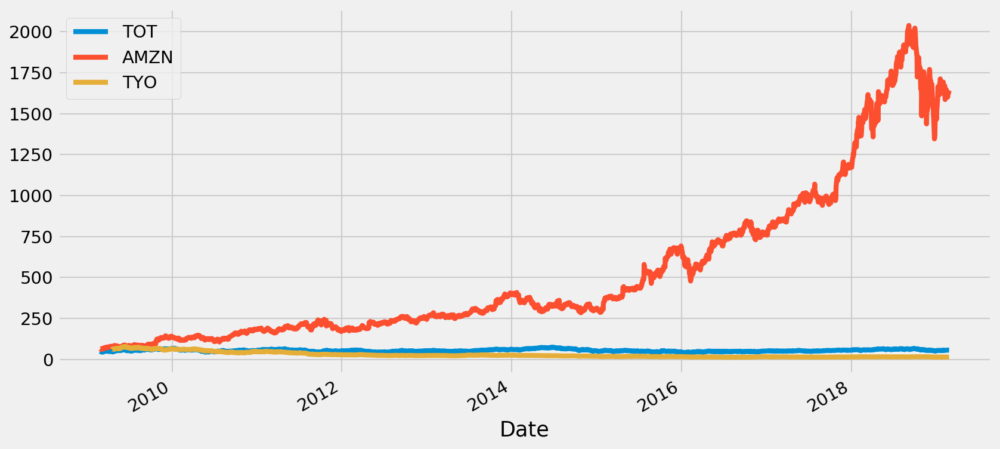

---
authors:
- admin
categories: [Python]
date: "2019-02-25"
draft: false
featured: true
image:
  caption: "[V skill](https://www.vskills.in/certification/blog/why-do-stock-prices-change-frequently/)"
  focal_point: ""
projects: []
subtitle: 
summary: Utiliser Pandas-datareader pour lire les prix des actions
tags: [Python,stock data, analysis]
title: Lire les données financières
---
# Lire des données financières

Aujourd'hui, grâce à la performance des ordinateurs et leurs puissance de calcul qui ne cesse d'augmenter il est facile de traiter une quantité phénoménale des données brutes en très peu de temps. Le traitement et l'extraction d'informations à partir de ces données en temps réel deviennent décisifs à mesure que croissent les enjeux associés à l'utilisation d'une information.  Presque toutes les grosses entreprises de la planète sont aujourd'hui côtées en bourse: que ce soit Facebook, Google, Amazon ou encore Apple pour ne citer que ces populaires là, les informations les concernant doivent être disponibles ainsi que les prédictions associées pour aider les acteurs des marchés financiers à se décider.  
Dans cet article, j'aimerais vous emmener un peu à l'aventure de traitement des données en passant premièrement à leur lecture en ligne, à la visualisation et à l'analyse. Allons-y

# La librairie `pandas_datareader`.   
Python a cet avantage qu'il existe beaucoup de librairies permettant de lire en temps réel les données financières. `Pandas_datareader`, `Quantopian` ou bien `Quandl` ne sont que quelques une des librairies qui permettent de faire ce travail. J'utiliserais cette première librairie pour cet article car elle est facile et fonctionne très bien avec Pandas.


```python
# Importation des librairies
% matplotlib inline
import pandas as pd
from pandas_datareader import DataReader, wb
import seaborn as sns
import matplotlib.pyplot as plt
```


```python
# Paramètres graphiques
plt.rcParams["figure.figsize"] = [12,6]
plt.rcParams["figure.dpi"] = 150
plt.style.use("fivethirtyeight")
```

Les librairies importées, passons maintenant à la lecture des informations financières. J'aimerais lire les informations de 3 informations. Une française, une américaine et une autre japonaise.  
Ces entreprises ne sont rien d'autres que Total, Amazon et Toyota.  
J'aimerais avoir leurs informations boursières d'il y a 10 ans à aujourd'hui 25 février 2019


```python
total = DataReader("TOT", data_source= "yahoo", start= "2009-02-25", end= "2019-02-25")
amazon = DataReader("AMZN", data_source= "yahoo", start= "2009-02-25", end= "2019-02-25")
toyota = DataReader("TYO", data_source= "yahoo", start= "2009-02-25", end= "2019-02-25")
```

J'ai décidé de lire les informations à partir de Yahoo Finance. Chaque entreprise côtée en bourse a ce qu'on applle un 'ticker', c'est le premier argument que j'ai rentré dans la fonction `DataReader` : pour Total c'est **TOT**, Amazon, **AMZN** et Toyota, **TYO**. La liste de ces tickers est en ligne, si vous voulez trouver une entreprise particulière il faut juste taper sur Google , ticker "nom de l'entreprise".   
Maintenant, regardons comment se présente chacune de ces données. 


```python
total.head()
```


<div>
<style scoped>
    .dataframe tbody tr th:only-of-type {
        vertical-align: middle;
    }

    .dataframe tbody tr th {
        vertical-align: top;
    }

    .dataframe thead th {
        text-align: right;
    }
</style>
<table border="1" class="dataframe">
  <thead>
    <tr style="text-align: right;">
      <th></th>
      <th>High</th>
      <th>Low</th>
      <th>Open</th>
      <th>Close</th>
      <th>Volume</th>
      <th>Adj Close</th>
    </tr>
    <tr>
      <th>Date</th>
      <th></th>
      <th></th>
      <th></th>
      <th></th>
      <th></th>
      <th></th>
    </tr>
  </thead>
  <tbody>
    <tr>
      <th>2009-02-25</th>
      <td>49.730000</td>
      <td>47.450001</td>
      <td>49.000000</td>
      <td>48.900002</td>
      <td>5140800.0</td>
      <td>28.170866</td>
    </tr>
    <tr>
      <th>2009-02-26</th>
      <td>48.959999</td>
      <td>47.759998</td>
      <td>48.160000</td>
      <td>47.910000</td>
      <td>4680700.0</td>
      <td>27.600544</td>
    </tr>
    <tr>
      <th>2009-02-27</th>
      <td>48.360001</td>
      <td>46.349998</td>
      <td>46.759998</td>
      <td>47.200001</td>
      <td>3990300.0</td>
      <td>27.191511</td>
    </tr>
    <tr>
      <th>2009-03-02</th>
      <td>46.189999</td>
      <td>43.599998</td>
      <td>45.810001</td>
      <td>43.720001</td>
      <td>4412600.0</td>
      <td>25.186716</td>
    </tr>
    <tr>
      <th>2009-03-03</th>
      <td>44.680000</td>
      <td>42.880001</td>
      <td>44.680000</td>
      <td>43.410000</td>
      <td>3934000.0</td>
      <td>25.008127</td>
    </tr>
  </tbody>
</table>
</div>


Pour chacune des entreprises ce sont ces informations que nous avons pour toute la période:   
La date est lue comme l'index de la base de donnée, et le grand avantage c'est qu'on a une donnée Pandas donc on peut utiliser toute la librairie pour analyser et extraire de l'information à partir d'elle.  
Les colonnes High et Low représentent le prix le plus haut de l'action au jour.  Open et Close sont les prix d'ouverture et de fermture ce même jour. 
Volume représente la quantité totale d'actions échangée échangée le jour. 

Pour pouvoir analyser ensemble ces données concernant les 3 entreprises on peut les joindre ensemble dans un seul base de donnée. 


```python
tickers = ["TOT", "AMZN", "TYO"]
```


```python
entreprises = pd.concat([total, amazon, toyota], axis = 1, keys= tickers)
```


```python
entreprises.head()
```


<div>
<style scoped>
    .dataframe tbody tr th:only-of-type {
        vertical-align: middle;
    }

    .dataframe tbody tr th {
        vertical-align: top;
    }

    .dataframe thead tr th {
        text-align: left;
    }

    .dataframe thead tr:last-of-type th {
        text-align: right;
    }
</style>
<table border="1" class="dataframe">
  <thead>
    <tr>
      <th></th>
      <th colspan="6" halign="left">TOT</th>
      <th colspan="6" halign="left">AMZN</th>
      <th colspan="6" halign="left">TYO</th>
    </tr>
    <tr>
      <th></th>
      <th>High</th>
      <th>Low</th>
      <th>Open</th>
      <th>Close</th>
      <th>Volume</th>
      <th>Adj Close</th>
      <th>High</th>
      <th>Low</th>
      <th>Open</th>
      <th>Close</th>
      <th>Volume</th>
      <th>Adj Close</th>
      <th>High</th>
      <th>Low</th>
      <th>Open</th>
      <th>Close</th>
      <th>Volume</th>
      <th>Adj Close</th>
    </tr>
    <tr>
      <th>Date</th>
      <th></th>
      <th></th>
      <th></th>
      <th></th>
      <th></th>
      <th></th>
      <th></th>
      <th></th>
      <th></th>
      <th></th>
      <th></th>
      <th></th>
      <th></th>
      <th></th>
      <th></th>
      <th></th>
      <th></th>
      <th></th>
    </tr>
  </thead>
  <tbody>
    <tr>
      <th>2009-02-25</th>
      <td>49.730000</td>
      <td>47.450001</td>
      <td>49.000000</td>
      <td>48.900002</td>
      <td>5140800.0</td>
      <td>28.170866</td>
      <td>65.750000</td>
      <td>62.820000</td>
      <td>64.900002</td>
      <td>63.709999</td>
      <td>9122100</td>
      <td>63.709999</td>
      <td>NaN</td>
      <td>NaN</td>
      <td>NaN</td>
      <td>NaN</td>
      <td>NaN</td>
      <td>NaN</td>
    </tr>
    <tr>
      <th>2009-02-26</th>
      <td>48.959999</td>
      <td>47.759998</td>
      <td>48.160000</td>
      <td>47.910000</td>
      <td>4680700.0</td>
      <td>27.600544</td>
      <td>64.730003</td>
      <td>62.340000</td>
      <td>64.120003</td>
      <td>62.340000</td>
      <td>7275300</td>
      <td>62.340000</td>
      <td>NaN</td>
      <td>NaN</td>
      <td>NaN</td>
      <td>NaN</td>
      <td>NaN</td>
      <td>NaN</td>
    </tr>
    <tr>
      <th>2009-02-27</th>
      <td>48.360001</td>
      <td>46.349998</td>
      <td>46.759998</td>
      <td>47.200001</td>
      <td>3990300.0</td>
      <td>27.191511</td>
      <td>65.080002</td>
      <td>60.939999</td>
      <td>61.259998</td>
      <td>64.790001</td>
      <td>11488300</td>
      <td>64.790001</td>
      <td>NaN</td>
      <td>NaN</td>
      <td>NaN</td>
      <td>NaN</td>
      <td>NaN</td>
      <td>NaN</td>
    </tr>
    <tr>
      <th>2009-03-02</th>
      <td>46.189999</td>
      <td>43.599998</td>
      <td>45.810001</td>
      <td>43.720001</td>
      <td>4412600.0</td>
      <td>25.186716</td>
      <td>65.519997</td>
      <td>61.509998</td>
      <td>63.939999</td>
      <td>61.990002</td>
      <td>10511900</td>
      <td>61.990002</td>
      <td>NaN</td>
      <td>NaN</td>
      <td>NaN</td>
      <td>NaN</td>
      <td>NaN</td>
      <td>NaN</td>
    </tr>
    <tr>
      <th>2009-03-03</th>
      <td>44.680000</td>
      <td>42.880001</td>
      <td>44.680000</td>
      <td>43.410000</td>
      <td>3934000.0</td>
      <td>25.008127</td>
      <td>63.290001</td>
      <td>61.299999</td>
      <td>62.750000</td>
      <td>61.700001</td>
      <td>9691600</td>
      <td>61.700001</td>
      <td>NaN</td>
      <td>NaN</td>
      <td>NaN</td>
      <td>NaN</td>
      <td>NaN</td>
      <td>NaN</td>
    </tr>
  </tbody>
</table>
</div>


En combinant les informations ensemble, on observe toute de suite que les données concernant Toyota en 2009 sont manquantes. Il semblerait donc que le groupe n'ait entré e bourse que plus tard. Regardons à partir de quel moment nous avons les informations le concernant.


```python
entreprises["TYO"]["Open"].first_valid_index()
```


    Timestamp('2009-04-16 00:00:00')


C'est donc à partir du 16 avril 2009 qu'on commence à trouver des informations disponibles concernant Toyota.

# Visualisation
## Evolution des prix plus haut


```python
tickers
```


    ['TOT', 'AMZN', 'TYO']


```python
for i, tick in enumerate(tickers):
    entreprises[tick]["Open"].plot()
    plt.legend(tickers)
```





La croissance des prix d'ouverture des actions Amazon est tellement fulgurante que sur l'echelle les deux autres prix sont mal représentés.  
On peut zoomer sur ce graphique en ajustant l'echelle à un echelle logarithmique pour observer l'évolution des données avec le temps.


```python
import numpy as np
```


```python
for i, tick in enumerate(tickers):
    np.log(entreprises[tick]["Open"]).plot()
    plt.legend(tickers)
plt.title(" Evolution du logarithme des prix d'ouverture")
plt.ylabel("Prix en logarithme");
```


```python
plt.figure(figsize = (10,14))
for i, tick in enumerate(tickers):
    plt.subplot(3,1, i+1)
    plt.plot(entreprises[tick]["High"])
    plt.title(f"High price for {tick}")
plt.tight_layout(h_pad = 2.5)
```


On observe pour ces trois entreprises que les variations des prix des actions diffèrent considérablement. Chez Total on observe une forte volatilité et une sorte de saisonalité, chez Amazon c'est une croissance fulgurante qu'on observe, depuis 2009 les prix ne cessent de grimper jusqu'à atteindre leur maximum mi 2018 pour baisser légrement ensuite. Quand à Toyota sur toute la période les prix ne font que baisser. Essayons de zoomer davantage sur ces données et considérons un horizon temporelle plus court : entre 2015 et 2019.

## A partir de 2015


```python
from_2015 = entreprises.loc["2015":,]
```


```python
plt.figure(figsize = (10,14))
for i, tick in enumerate(tickers):
    plt.subplot(3,1, i+1)
    plt.plot(from_2015[tick]["High"])
    plt.title(f"High price for {tick}")
plt.tight_layout(h_pad = 2.5)
```


-----------------------------------------------------------------------------------------
-----------------------------------------------------------------------------------------

Voilà donc pour cet article ! Mon but était principalement de vous présenter comment il est possible de lire les informations financières en ligne. Les possibilité d'analyse sont nombreuses, on aura pu estimer et prévoir la volatilité de ces prix avec des modèles de type GARCH mais laissons cela pour une prochaine série ! 
