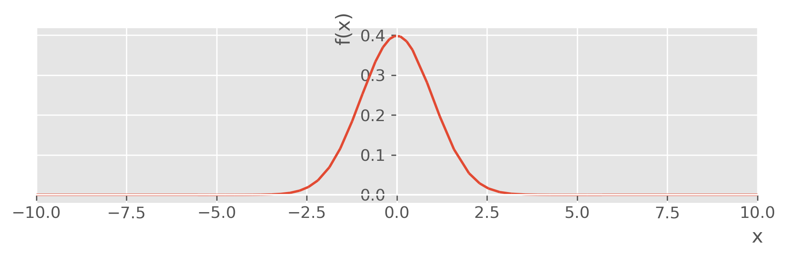
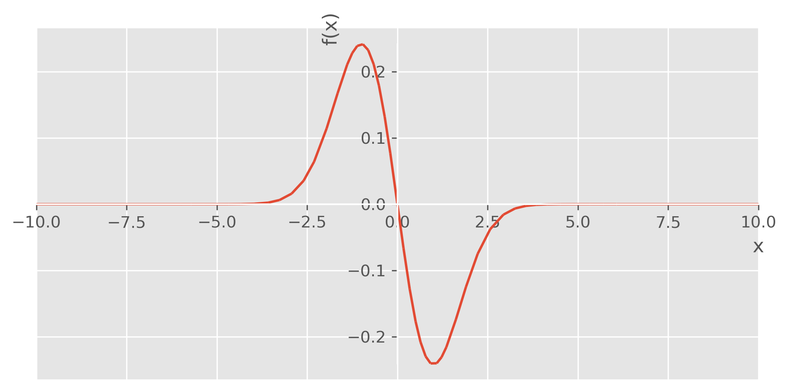

---
authors:
- admin
categories: [Python, Econométrie]
date: "2019-11-10"
draft: false
featured: true
image:
  caption: ""
  focal_point: ""
projects: []
subtitle: 
summary: Démonstration simple d'une gaussienne avec la librarie du calcul symbolique sympy en Python.
tags: [Python, sympy]
title: Gaussienne avec sympy
---


# Les mathématiques symboliques avec Python

## Fonction de densité d'une gaussienne


```python
from sympy import symbols, pi, exp, sqrt, plot
x, mu, sigma = symbols("x, mu, sigma")
```


```python
density = (1/(sigma*sqrt(2*pi))) * (exp(-1/2* ((x-mu)/sigma)**2))
```

## Représentation graphique d'une gaussienne centrée réduite


```python
%matplotlib inline
import matplotlib.pyplot as plt
plt.style.use("ggplot")
plt.rcParams["figure.figsize"] = (8, 2)
plt.rcParams["figure.dpi"] = 300
plot(density.subs({mu : 0, sigma : 1}))
```





    <sympy.plotting.plot.Plot at 0x2d3e8ec0278>


## Représentation de sa dérivée aux points {mu : 0, sigma :1)


```python
plot(density.diff(x).subs({mu : 0, sigma : 1}))
```





    <sympy.plotting.plot.Plot at 0x2d3e8e78f28>


