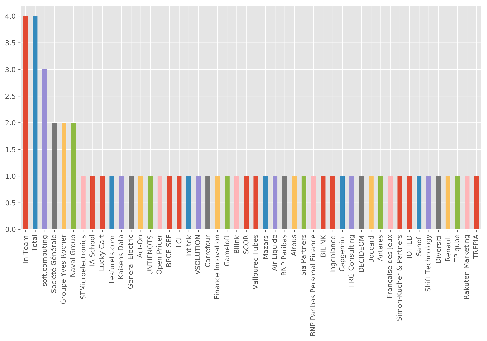

authors:
- admin
categories: [Python]
date: "2019-05-26T00:00:00Z"
draft: false
featured: false
image:
  caption: ""
  focal_point: ""
projects: []
subtitle: 
summary: Adapter ses compétences aux besoins du marché du travail en scrapant les offres d'emploi
tags: [Python,webscrape, analysis]
title: Adapter ses compétences aux besoins du marché du travail
# Adapter ses compétences aux besoins du marché du travail

## Introduction  
Aujourd'hui, plus que jamais dans l'histoire, nous vivons dans une ère où rien n'est figé. Ce qu'on connait aujourd'hui risque de changer demain dans le but d'accroître l'efficacité des facteurs de production. Il arrive des fois que les compétences enseignées par les universités où les instituts d'études supérieures soient en retard par rapport aux standards des entreprises, voilà pourquoi il est important de se mettre à jour sur les avancées technologiques afin de bien se positionner sur le marché du travail.   
Dans cet article j'aimerais avoir une idée sur les compétences que demandent les entreprises aujourd'hui ainsi que le niveau de formation qu'ils exigent pour les métiers de data science / analytics.  
  
  
Pour ce faire je travaillerai avec le langage Python pour scraper le site Indeed par le biais des mots clés.


```python
# Importons les librairies
import pandas as pd
from requests import get
from requests.exceptions import RequestException
from bs4 import BeautifulSoup
```

Le langage Python est riche et facile à manier pour ce genre de tâche, il contient de nombreuses librairies pour faire presque tout ce qu'on veut.  
Dans cet article j'utilise les librairies `Pandas`, `BeautifulSoup` et le module `requests` qui fait partie de la librairie standard pour conduire ce projet. 

# Le site `Indeed`
Indeed est un site web américain spécialisé dans la mise en relation entre les entreprises et les demandeurs d'emploi. Des milliers d'offres d'emploi y sont présentes et ce site constitue un bon endroit pour scraper les offres d'emploi afin d'avoir des idées sur les compétences recherchées par les entreprises.  
Le site ressemble à ceci :


## Web scraping
Le web scraping est un terme anglophone utilisé pour désigner l'action de fouiller des informations sur un site web.  
Nous allons donc ici fouiller le site web d'Indeed pour le mot clé `data science` pour toutes les offres publiées pour la France.  


```python
# Faisons une première requête, ceci équivaut à consulter la page sur un navigateur
url = """https://www.indeed.fr/emplois?as_and=data+science&as_phr=&as_any=&as_not=&as_ttl=&as_cmp=&jt=all&st=&as_
src=&salary=&radius=25&l=France&fromage=any&limit=100&sort=&psf=advsrch
"""
indeed = get(url)
```

Ici l'objet `indeed` enregistre les résultats bruts de recherche. Il s'agit d'une page HTML. Il nous faut filtrer cette page pour avoir l'information que nous cherchons.

## Nom des entreprises


```python
soup = BeautifulSoup(indeed.text, "html.parser")
```

Nous venons d'utiliser la classe `BeautifulSoup` pour formatter l'objet `indeed` en quelque chose de plus structuré.


```python
company = soup.find_all('span', {'class': 'company'})
```


```python
entreprise = []
for comp in company:
    entreprise.append(comp.text.strip())
```


```python
entreprise[0:4]
```


    ['Total', 'Total', 'BNP Paribas Personal Finance', 'Lucky Cart']


## Description des activités


```python
resume = soup.find_all('div', {'class': 'summary'})
```


```python
type(resume)
```


    bs4.element.ResultSet


```python
description = []
for desc in resume:
    description.append(desc.text.strip())
```


```python
description[0:4]
```


    ['Promouvoir la data science. Gérer les pilotes data science (big data et/ou data mining), en coordination avec les autres métiers et entités....',
     'PhD (or MSc/ME with equivalent experience) in Data Science, Applied Mathematics, Statistics or a related discipline....',
     'Vous serez un facteur clé de la montée en compétence du Groupe en matière de Data Science, notamment par une veille technologique active sur les sujets Big Data...',
     '2 ans d’expérience mini en développement pour la data science avec au moins l’une des problématiques suivantes :....']


## Titre de l'offre


```python
title = soup.find_all("div", {"class": "title"})
titre = []
for t in title:
    titre.append(t.text.strip())
```


```python
titre[0:4]
```


    ['Data scientist H/F',
     'Data Science and Artificial Intelligence Research Scientist',
     'DATA SCIENTIST H/F',
     'Data Engineer']


## Lieu du travail


```python
location = soup.find_all("span", {"class": "location"})
lieu = []
for loc in location:
    lieu.append(loc.text.strip())
```

Dans les codes HTML du site, le lieu apparaît à la fois sous les tags `span` et `div`. Donc il faut prendre en compte les deux.  
Et heureusement, les tags `div` sont les 8 derniers.


```python
location_div = soup.find_all("div", {"class": "location"})
for loc in location_div:
    lieu.append(loc.text.strip())
```


```python
lieu[0:4]
```


    ['Paris (75)', 'Paris (75)', 'Chilly-Mazarin (91)', 'Vélizy-Villacoublay (78)']


# Data frame

Maintenant que nous avons pu trouver les informations qui nous intéressent, nous pouvons maintenant assembler ces données dans un Data frame afin de les analyser.


```python
list(map(len, [titre, entreprise, lieu, description]))
```


    [59, 59, 59, 59]


Nous avons donc toutes les 58 locations. Créons notre objet Pandas.


```python
data_science = pd.DataFrame({"titre": titre, "entreprise": entreprise,
             "lieu":lieu, "description": description})
```


```python
data_science.head()
```


<div>
<style scoped>
    .dataframe tbody tr th:only-of-type {
        vertical-align: middle;
    }

    .dataframe tbody tr th {
        vertical-align: top;
    }

    .dataframe thead th {
        text-align: right;
    }
</style>
<table border="1" class="dataframe">
  <thead>
    <tr style="text-align: right;">
      <th></th>
      <th>titre</th>
      <th>entreprise</th>
      <th>lieu</th>
      <th>description</th>
    </tr>
  </thead>
  <tbody>
    <tr>
      <th>0</th>
      <td>Data scientist H/F</td>
      <td>Total</td>
      <td>Paris (75)</td>
      <td>Promouvoir la data science. Gérer les pilotes ...</td>
    </tr>
    <tr>
      <th>1</th>
      <td>Data Science and Artificial Intelligence Resea...</td>
      <td>Total</td>
      <td>Paris (75)</td>
      <td>PhD (or MSc/ME with equivalent experience) in ...</td>
    </tr>
    <tr>
      <th>2</th>
      <td>DATA SCIENTIST H/F</td>
      <td>BNP Paribas Personal Finance</td>
      <td>Chilly-Mazarin (91)</td>
      <td>Vous serez un facteur clé de la montée en comp...</td>
    </tr>
    <tr>
      <th>3</th>
      <td>Data Engineer</td>
      <td>Lucky Cart</td>
      <td>Vélizy-Villacoublay (78)</td>
      <td>2 ans d’expérience mini en développement pour ...</td>
    </tr>
    <tr>
      <th>4</th>
      <td>Ingénieur Big Data H/F</td>
      <td>Naval Group</td>
      <td>Toulon (83)</td>
      <td>Concevoir et développer des solutions pour les...</td>
    </tr>
  </tbody>
</table>
</div>


## Décrivons le jeu de données


```python
data_science.describe()
```


<div>
<style scoped>
    .dataframe tbody tr th:only-of-type {
        vertical-align: middle;
    }

    .dataframe tbody tr th {
        vertical-align: top;
    }

    .dataframe thead th {
        text-align: right;
    }
</style>
<table border="1" class="dataframe">
  <thead>
    <tr style="text-align: right;">
      <th></th>
      <th>titre</th>
      <th>entreprise</th>
      <th>lieu</th>
      <th>description</th>
    </tr>
  </thead>
  <tbody>
    <tr>
      <th>count</th>
      <td>59</td>
      <td>59</td>
      <td>59</td>
      <td>59</td>
    </tr>
    <tr>
      <th>unique</th>
      <td>56</td>
      <td>48</td>
      <td>25</td>
      <td>57</td>
    </tr>
    <tr>
      <th>top</th>
      <td>Data Science and Artificial Intelligence Resea...</td>
      <td>In-Team</td>
      <td>Paris (75)</td>
      <td>PhD (or MSc/ME with equivalent experience) in ...</td>
    </tr>
    <tr>
      <th>freq</th>
      <td>2</td>
      <td>4</td>
      <td>23</td>
      <td>2</td>
    </tr>
  </tbody>
</table>
</div>


Voici donc un simple tableau qui nous donne les statistiques descriptives du jeu de donnée.  
Sur les 5ç offres, 23 se trouvent à Paris (75). Regardons cela visuellement


```python
%matplotlib inline
import matplotlib.pyplot as plt
# reglages
plt.rcParams["figure.figsize"] = [12,6]
plt.rcParams["figure.dpi"] = 300
plt.style.use("ggplot")
```


```python
data_science["lieu"].value_counts().plot(kind = "bar")
plt.title("Nombre d'offres d'emploi par lieu");
```


Le constat est clair : presque toutes les offres d'emploi qui parlent de data science sont concentrées en région parisienne. Si quelqu'un se prépare donc exercer le métier de data scientist il faudra donc considérer à postuler dans les entreprises parisiennes. 

Et les entreprises ?


```python
data_science["entreprise"].value_counts().plot(kind = "bar");
```





Les offres d'emploi par entreprise ne suivent aucune tendance. Il y a juste qu'à remarquer que la plupart de ces entreprises se situent en région parisienne.

## Analyse textuelle des titres et des descriptions


```python
data_science["titre"].head()
```


    0                                   Data scientist H/F
    1    Data Science and Artificial Intelligence Resea...
    2                                   DATA SCIENTIST H/F
    3                                        Data Engineer
    4                               Ingénieur Big Data H/F
    Name: titre, dtype: object


Les titres ne suivent pas une structure définie, il nous faut d'abord les normaliser : enlever les ponctuations, les majuscules etc...


```python
from string import punctuation
```


```python
print(punctuation)
```

    !"#$%&'()*+,-./:;<=>?@[\]^_`{|}~
    


```python
words = " ".join(titre).translate(str.maketrans("","", punctuation)).lower()
```


```python
from wordcloud import WordCloud, STOPWORDS
```


```python
plt.rcParams["figure.dpi"] = 300
wc = WordCloud(background_color="white", width= 800, height= 400).generate(words)
plt.imshow(wc)
plt.axis("off");
```


Dans les titres on peut déjà avoir une idée de ce que cherchent les entreprises. Il y a plusieurs mots-clés qui reviennent dans les offres d'emploi.  
Les expressions `data science` et `data scientist` reviennent souvent mais n'ont pas réellement de sens puisque la data science est large. Pour avoir une idée des compétences et savoirs-faire, penchons nous sur les descriptions.

Pour n'avoir que les mots clés, il nous faut enlever les mots vides de la langue française. Ce sont des mots comme "de", "le", "la", "en". Ces mots existent pour embellir la langue et donner du sens dans une phrase or notre but est de chercher les mots clés.


```python
from nltk.corpus import stopwords
```


```python
mots_vides = stopwords.words("french")
```


```python
update = ["les", "data", "science", "data science", "or", "tant", "d'une", "scientist"]
for word in update:
    mots_vides.append(word)
```


```python
desc = data_science["description"].str.lower().str.translate(str.maketrans(" "," ", punctuation))
```


```python
desc = " ".join(desc).split()
```


```python
desc = " ".join([word for word in desc if word not in mots_vides])
```


```python
desc_wc = WordCloud(background_color= "white", width = 1200, height = 600).generate(desc)
plt.imshow(desc_wc, interpolation='bilinear')
plt.axis("off");
```


```python

```
